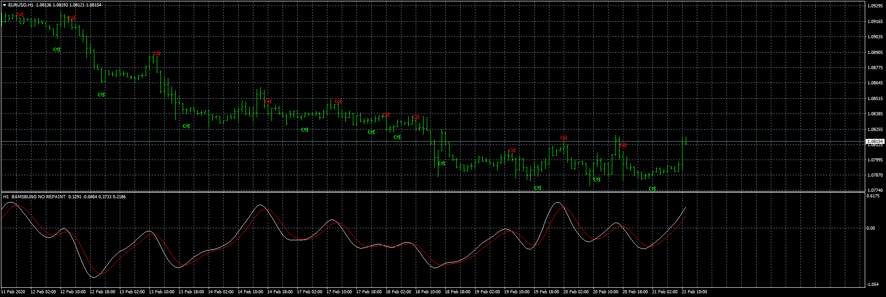
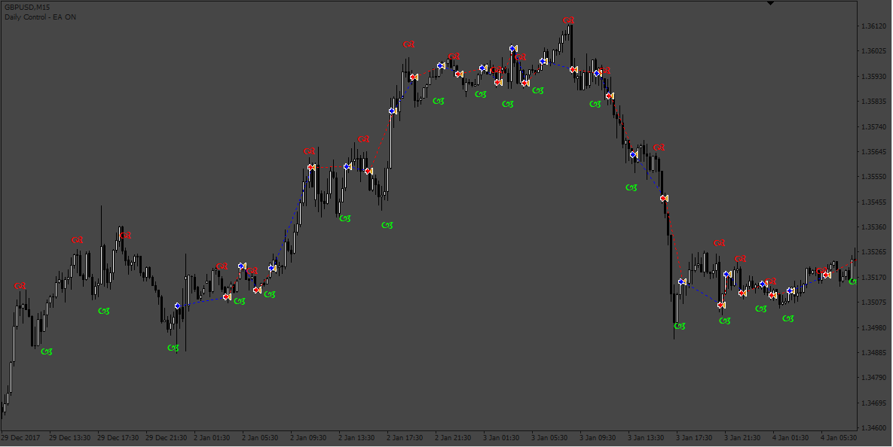
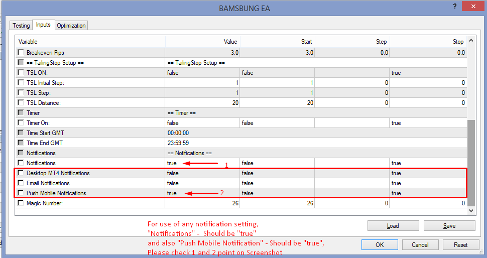
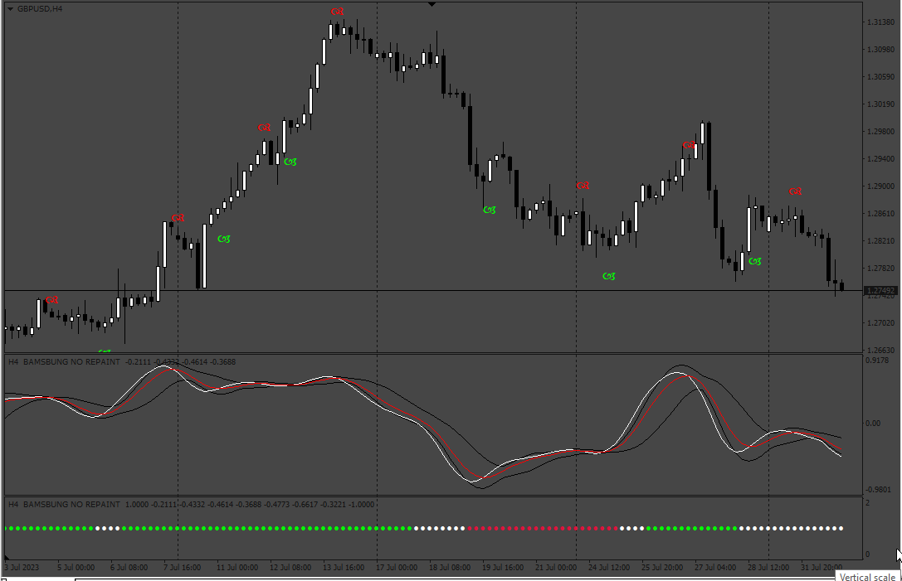
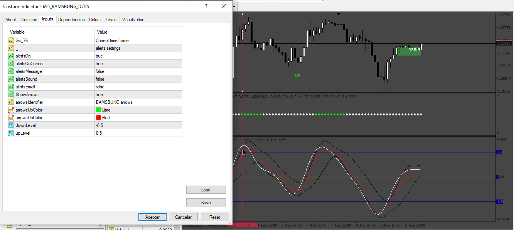
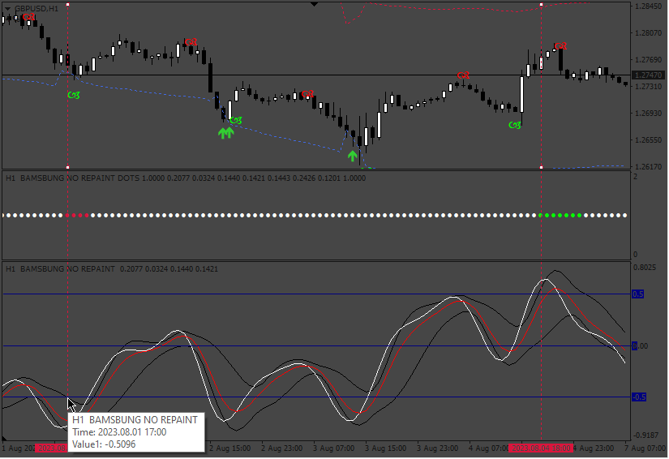

# #BAMSBUNG-NO REPAINT-3

> Source: https://fxcodebase.com/code/viewtopic.php?f=38&t=69434  
> Forum: 38 · Topic 69434 · 24 post(s)

---

## #BAMSBUNG-NO REPAINT-3

**Apprentice** · Fri Feb 21, 2020 6:23 am

Based on request.
[viewtopic.php?f=27&t=69424](https://fxcodebase.com/code/viewtopic.php?f=27&t=69424)

 [#BAMSBUNG-NO REPAINT-3.mq4](files/131408/BAMSBUNG-NO%20REPAINT-3.mq4)

 [Bams-bung.dll](files/131408/Bams-bung.dll)

 [BAMSBUNG.dll](files/131408/BAMSBUNG.dll)

---

## Re: #BAMSBUNG-NO REPAINT-3

**richard85** · Tue Jun 22, 2021 8:22 am

Hi Apprentice!

can you please add a buffer for the arrow up/down?
buffer5 for up and buffer6 for down

---

## Re: #BAMSBUNG-NO REPAINT-3

**Apprentice** · Fri Jun 25, 2021 5:03 am

I'm not sure what you mean with "buffer"?
Can you show on example?

---

## Re: #BAMSBUNG-NO REPAINT-3

**richard85** · Fri Jun 25, 2021 6:04 am

> **Apprentice wrote:**
> I'm not sure what you mean with "buffer"?
> Can you show on example?

---

## Re: #BAMSBUNG-NO REPAINT-3

**richard85** · Fri Jun 25, 2021 6:04 am

> **Apprentice wrote:**
> I'm not sure what you mean with "buffer"?
> Can you show on example?

---

## Re: #BAMSBUNG-NO REPAINT-3

**Apprentice** · Sat Jun 26, 2021 5:23 am

Your request is added to the development list.
Development reference 603.

---

## Re: #BAMSBUNG-NO REPAINT-3

**Apprentice** · Tue Jul 06, 2021 2:59 am

Why not look for an arrow on the chart?

for (int k = ObjectsTotal(); k >= 0; k--)
 {
 string name = ObjectName(0, k);
 datetime time = (datetime)ObjectGetInteger(0, name, OBJPROP_TIME);
 if (time >= date && StringFind(name, "BAMSBUNG arrows") == 0)
 {
 return ObjectGetDouble(0, name, OBJPROP_PRICE) <= iLow(_symbol, _timeframe, period); // new up arrow
 }
 }
 for (int k = ObjectsTotal(); k >= 0; k--)
 {
 string name = ObjectName(0, k);
 datetime time = (datetime)ObjectGetInteger(0, name, OBJPROP_TIME);
 if (time >= date && StringFind(name, "BAMSBUNG arrows") == 0)
 {
 return ObjectGetDouble(0, name, OBJPROP_PRICE) >= iHigh(_symbol, _timeframe, period); // new down arrow
 }
 }

---

## Re: #BAMSBUNG-NO REPAINT-3

**richard85** · Tue Jul 06, 2021 7:16 am

i want to create an expert advisor for this indicator... thats why i need the buffer... just to find the buy and sell signals...

---

## Re: #BAMSBUNG-NO REPAINT-3

**sman1478** · Thu Nov 25, 2021 9:08 am

Is there anyone that can help me Change this indicator to a MT5 version? I am stuck with the conversion with a couple of errors.

Thank you

---

## Re: #BAMSBUNG-NO REPAINT-3

**Apprentice** · Fri Nov 26, 2021 4:39 am

Your request is added to the development list.
Development reference 1002.

---

## Re: #BAMSBUNG-NO REPAINT-3

**Elioak** · Sun Jan 09, 2022 6:48 pm

Can you please make this indicator into an EA and add EMA filter?
Only take buy signals when price is above EMA and sell signals when price is below EMA

---

## Re: #BAMSBUNG-NO REPAINT-3

**Apprentice** · Mon Jan 10, 2022 2:05 pm

Your request is added to the development list.
Development reference 26.

---

## Re: #BAMSBUNG-NO REPAINT-3

**Apprentice** · Mon Feb 07, 2022 3:25 am

Try this version.

 [BAMSBUNG EA.mq4](files/144961/BAMSBUNG%20EA.mq4)

---

## Re: #BAMSBUNG-NO REPAINT-3

**KnifeS2** · Thu May 05, 2022 1:55 pm

Hello guys,

Thanks for your great work, can you please add Push Notification to the phone MT4?

Regards
KnifeS2

---

## Re: #BAMSBUNG-NO REPAINT-3

**Apprentice** · Fri May 06, 2022 5:22 am

We have added your request to the development list.
Development reference 277.

---

## Re: #BAMSBUNG-NO REPAINT-3

**Apprentice** · Wed May 18, 2022 9:09 am

 [BAMSBUNG_EA.mq4](files/146030/BAMSBUNG_EA.mq4)

---

## Re: #BAMSBUNG-NO REPAINT-3

**4xPulse** · Thu May 26, 2022 11:06 am

Hi

This indicator works on the Chart Time Frame,

Please add a dropdown in the Indicator so it can be set to an independent TimeFrame irrespective of the Chart Time Frame.

Also, provide the MT5 version after adding the above features.

Thanks.

---

## Re: #BAMSBUNG-NO REPAINT-3

**Apprentice** · Fri May 27, 2022 11:50 am

We have added your request to the development list.
Development reference 317.

---

## Re: #BAMSBUNG-NO REPAINT-3

**Josan70** · Mon Jul 31, 2023 11:21 am

Hello apprentice!
It would be possible to modify this flag to turn the lines into squares as per the photo attached now. But in the configuration there must be values ​​of switchable levels. And although the lines are modified once the box has been drawn, it is not redrawed. In other words, do not repaint anything.

Regards, and thank you very much .

---

## Re: #BAMSBUNG-NO REPAINT-3

**Apprentice** · Mon Jul 31, 2023 6:06 pm

We have added your request to the development list.
Development reference 672.

---

## Re: #BAMSBUNG-NO REPAINT-3

**Apprentice** · Tue Aug 01, 2023 4:44 pm

 [BAMSBUNG_DOTS.mq4](files/151871/BAMSBUNG_DOTS.mq4)

---

## Re: #BAMSBUNG-NO REPAINT-3

**Josan70** · Wed Aug 02, 2023 8:30 am

Hello apprentice. I think I have explained myself very badly. The levels I was referring to are levels of straight lines starting at 0. They are not the levels that can mark those bands that the indicator has. If it could be modified that would be great. For the rest, everything would be fine.

Thank you so much .

---

## Re: #BAMSBUNG-NO REPAINT-3

**Apprentice** · Tue Aug 08, 2023 4:04 am

We have added your request to the development list.
Development reference 695.

---

## Re: #BAMSBUNG-NO REPAINT-3

**Apprentice** · Thu Aug 10, 2023 12:26 pm

 

 [BAMSBUNG_DOTS.mq4](files/152007/BAMSBUNG_DOTS.mq4)
