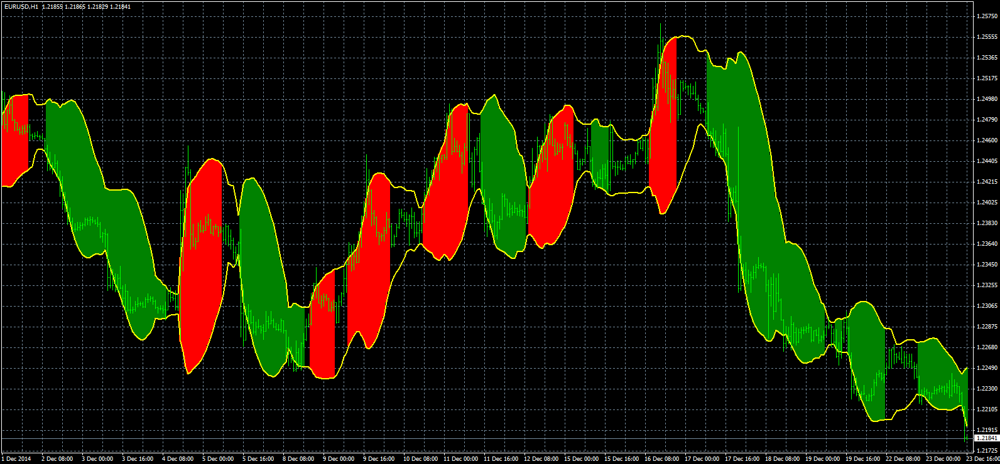
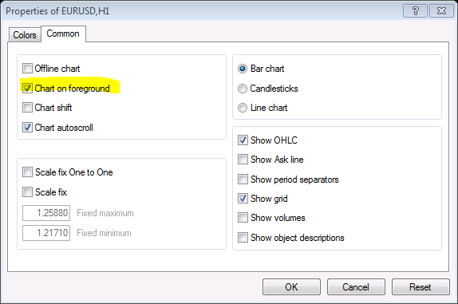

# Bands fill indicator

> Source: https://fxcodebase.com/code/viewtopic.php?f=38&t=62403  
> Forum: 38 · Topic 62403 · 1 post(s)

---

## Bands fill indicator

**Apprentice** · Mon Jul 06, 2015 8:31 am

TS2 version.
[viewtopic.php?f=17&t=6487](https://fxcodebase.com/code/viewtopic.php?f=17&t=6487)

The indicator is a Bollinger band painted as follows.
If the price crosses the top band of the indicator is colored in UP color.
If the price crosses the bottom band of the indicator is colored in DN color.

 [Bands_Fill.mq4](files/101298/Bands_Fill.mq4)

 [Bands_Fill.mq5](files/101298/Bands_Fill.mq5)

 

Make sure to switch on "Chart on foreground"
