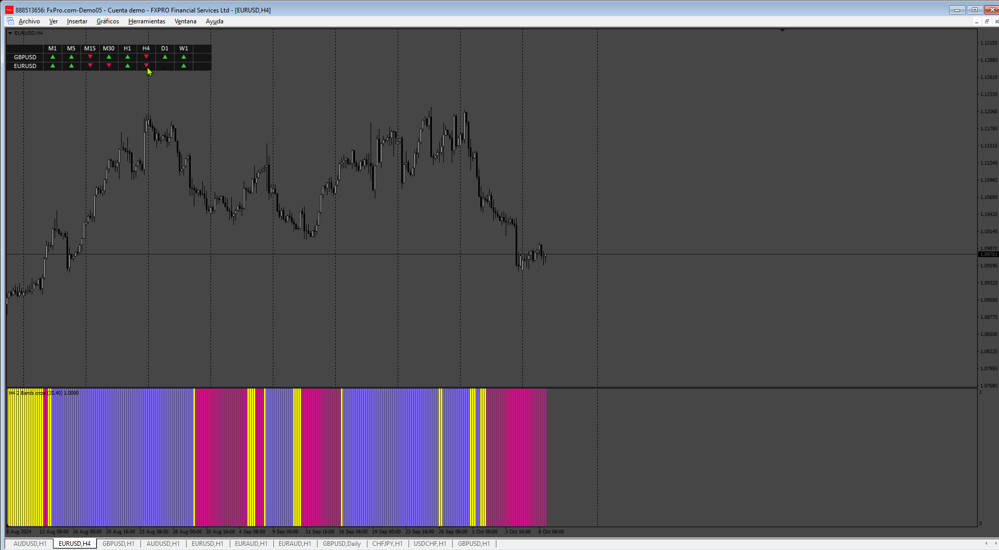

# BandsCross_Dashboard

> Source: https://fxcodebase.com/code/viewtopic.php?f=38&t=75274  
> Forum: 38 · Topic 75274 · 4 post(s)

---

## BandsCross_Dashboard

**Apprentice** · Sat Oct 12, 2024 12:20 pm

Based on the request.
[https://fxcodebase.com/code/viewtopic.php?f=38&t=75253](https://fxcodebase.com/code/viewtopic.php?f=38&t=75253)

 [2_bands_cross_mtf.mq4](files/156954/2_bands_cross_mtf.mq4)

 [BandsCross_Dashboard.mq4](files/156954/BandsCross_Dashboard.mq4)

---

## Re: BandsCross_Dashboard

**Teruyoshi** · Sat Oct 12, 2024 9:07 pm

Thanks for creating. I appreciate you but I want this guy to be modified a little so that I can select the time frames to be shown as I like. I don't need all timeframes at the same time.
Would you add that function?
I look forward to hearing from you.

---

## Re: BandsCross_Dashboard

**Apprentice** · Thu Oct 17, 2024 5:18 pm

We have added your request to the development list.
Development reference 796

---

## Re: BandsCross_Dashboard

**Apprentice** · Sat Oct 26, 2024 6:03 am

[BandsCross_Dashboard.mq4](files/157079/BandsCross_Dashboard.mq4)

Try this version.
