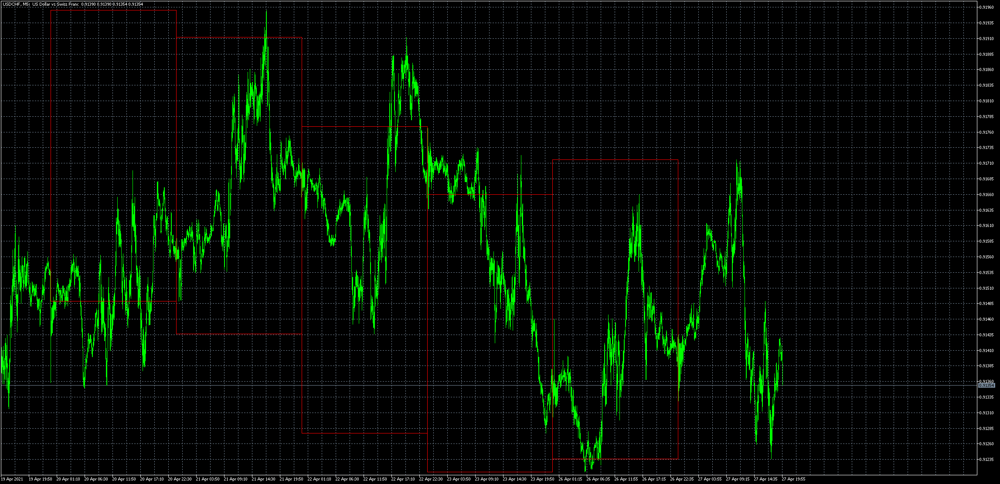

# Bar_Box

> Source: https://fxcodebase.com/code/viewtopic.php?f=38&t=71145  
> Forum: 38 · Topic 71145 · 6 post(s)

---

## Bar_Box

**Apprentice** · Tue Apr 27, 2021 12:05 pm

Based on the request.
[https://fxcodebase.com/code/viewtopic.p ... 33#p141633](https://fxcodebase.com/code/viewtopic.php?f=27&p=141633#p141633)

 [Bar_Box.mq5](files/141763/Bar_Box.mq5)

---

## Re: Bar_Box

**logicgate** · Mon May 03, 2021 5:01 am

brilliant, gonna test it today

---

## Re: Bar_Box

**logicgate** · Fri May 07, 2021 11:51 am

Indicator is not working properly.

Check the image attached. Green box was supposed to be monthly, it almost got march right, then in april completely went bonkers.

The red boxes were supposed to be weekly, all wrong too.

I thought it was because maybe two indicators were loaded at the same time, but even using them one by chart gives the same result.

Also, for two indicators with same name to not clash they need to have an ID option in them so the settings of one won´t affect the other.

Or you can add the Daily, Weekly and Monthly option as separate options in indi settings so you don´t need to load the indicator 3 times.

---

## Re: Bar_Box

**Apprentice** · Sat May 08, 2021 4:27 am

Your request is added to the development list.
Development reference 454.

---

## Re: Bar_Box

**Apprentice** · Tue May 11, 2021 3:51 am

[Bar_Box.mq5](files/142007/Bar_Box.mq5)

Try this version.

---

## Re: Bar_Box

**logicgate** · Tue May 11, 2021 5:05 am

Working perfectly now buddy, thanks!
