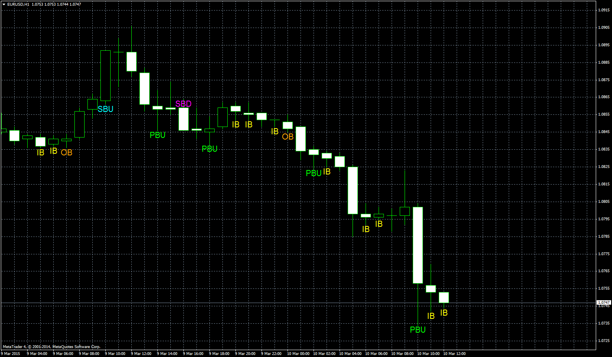

# Bars Identifier

> Source: https://fxcodebase.com/code/viewtopic.php?f=38&t=61985  
> Forum: 38 · Topic 61985 · 3 post(s)

---

## Bars Identifier

**Apprentice** · Tue Mar 10, 2015 5:07 am

Based on TS2/Lua version
[viewtopic.php?f=17&t=61974](https://fxcodebase.com/code/viewtopic.php?f=17&t=61974)

 [Bars Identifier.mq4](files/99158/Bars%20Identifier.mq4)

---

## Re: Bars Identifier

**clemmo** · Sat Jun 29, 2019 8:20 pm

What do the bar labels mean?

---

## Re: Bars Identifier

**Apprentice** · Sun Jun 30, 2019 5:51 pm

Pin Bars,Shaved Bars,Inside Bars,Outside Bars.
