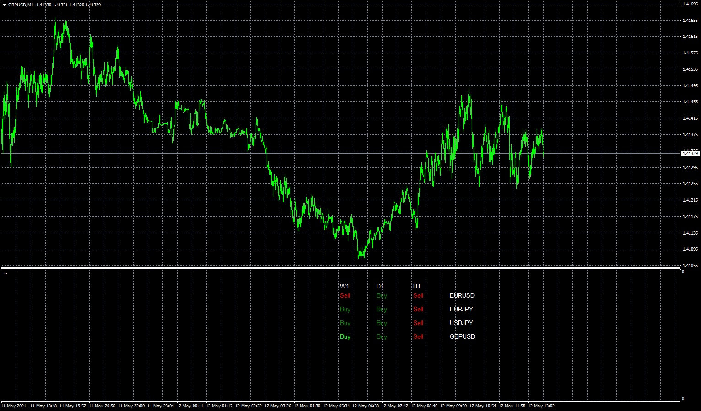
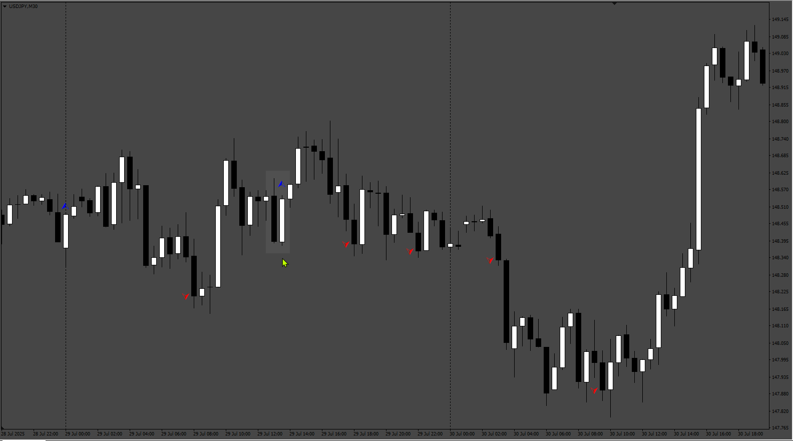

# Bastos1983_scanner

> Source: https://fxcodebase.com/code/viewtopic.php?f=38&t=71187  
> Forum: 38 · Topic 71187 · 48 post(s)

---

## Bastos1983_scanner

**Apprentice** · Wed May 12, 2021 5:35 am

Based on the request.
[https://fxcodebase.com/code/viewtopic.p ... 43#p141943](https://fxcodebase.com/code/viewtopic.php?f=27&p=141943#p141943)

 [Bastos1983_scanner.mq4](files/142046/Bastos1983_scanner.mq4)

---

## Re: Bastos1983_scanner

**Bastos1983** · Thu May 13, 2021 4:52 am

bonjour je ne peut pas telecharger le mql4...

---

## Re: Bastos1983_scanner

**Apprentice** · Thu May 13, 2021 5:14 am

Try it now.

---

## Re: Bastos1983_scanner

**Bastos1983** · Thu May 13, 2021 7:22 am

est ce qu il serait possible d avoir le signal en flèche sur le graphique
est ce qu il serait possible aussi de ajouter une MA supplémentaire pour filtrer les signaux

1)would it be possible to have the arrow signal on the graph
2)would it also be possible to add an additional MA to filter the signals?

---

## Re: Bastos1983_scanner

**Apprentice** · Fri May 14, 2021 4:30 am

1) as on chart arrow, for a single instrumentnt, NOT as a dashboard?
2) sure. can you define the filter rules?

---

## Re: Bastos1983_scanner

**Bastos1983** · Fri May 14, 2021 11:36 am

oui le créer en indicateur !
et qu il suive une MA long terme pour éviter les signaux dans tout les sens svp

---

## Re: Bastos1983_scanner

**Bastos1983** · Sat May 15, 2021 4:02 am

est ce qui serai possible de décalé le scanner completement a gauche ?

yes create it as an indicator!
and that he follow a long term MA to avoid signals all over the place please
will it be possible to shift the scanner completely to the left?

---

## Re: Bastos1983_scanner

**Apprentice** · Sat May 15, 2021 7:49 am

Your request is added to the development list.
Development reference 479.

---

## Re: Bastos1983_scanner

**Apprentice** · Mon May 17, 2021 8:44 am

[Bastos1983.mq4](files/142126/Bastos1983.mq4)

Something like this?

---

## Re: Bastos1983_scanner

**Bastos1983** · Mon May 17, 2021 2:21 pm

bonjour je test est je reviens vers vous merci pour tout se que vous faite

---

## Re: Bastos1983_scanner

**Bastos1983** · Tue Jun 01, 2021 3:13 pm

bonjour, faudrait ajouter des filtres.
un rsi et un stockastique:
rsi au-dessus du niveau 50 +croisement haussier du stockastique =signal haussier
rsi en-dessous du niveau 50 + croisement baissier du stockastique = signal baissier
et si possible ajouter des boutons en bas a gauche buy/sell pour que l indicateur donne des signaux buy ou sell celons mon choix svp merci

hello, filters should be added.
a rsi and a stockastic:
rsi above level 50 + bullish stockastic cross = bullish signal
rsi below level 50 + bearish stockastic cross = bearish signal
and if possible add buttons at the bottom left buy / sell so that the indicator gives buy or sell signals according to my choice please thank you

---

## Re: Bastos1983_scanner

**Apprentice** · Wed Jun 02, 2021 4:02 am

Your request is added to the development list.
Development reference 546.

---

## Re: Bastos1983_scanner

**Apprentice** · Tue Jun 08, 2021 10:31 am

Try this version.

 [Bastos1983_scanner.mq4](files/142462/Bastos1983_scanner.mq4)

What is a bullish stochastic cross?

---

## Re: Bastos1983_scanner

**Bastos1983** · Sat Jun 12, 2021 7:00 am

hello you are wrong indicator it was on the bastos1983 mql4 which had to be modified! I would like to add the RSI and stochastic filters.
example:
buy = above MovingAverage + rsi above 50 + stochastic buy signal.
sell = below MovingAverage + rsi below 50 + stochastic sell signal.

and add a sell / buy button on the chart to choose the signals I want.
I join you the indicator to modify and photo for the model thank

---

## Re: Bastos1983_scanner

**Apprentice** · Sun Jun 13, 2021 7:11 am

Your request is added to the development list.
Development reference 570.

---

## Re: Bastos1983_scanner

**Apprentice** · Tue Jun 15, 2021 1:49 pm

[Bastos1983.mq4](files/142518/Bastos1983.mq4)

What is a stochastic buy signal?

---

## Re: Bastos1983_scanner

**Bastos1983** · Wed Jun 16, 2021 11:36 am

on the stochastic there are 2 moving averages.
a main and a signal.
buy = the moving signal below the main one. = crossing
sell = the moving signal above the main = crossing

---

## Re: Bastos1983_scanner

**Bastos1983** · Wed Jun 16, 2021 11:37 am

and also the sell / buy button to choose which signal I want please thank you

---

## Re: Bastos1983_scanner

**Apprentice** · Wed Jun 16, 2021 1:09 pm

Your request is added to the development list.
Development reference 579.

---

## Re: Bastos1983_scanner

**Apprentice** · Fri Jun 18, 2021 5:07 am

[Bastos1983.mq4](files/142562/Bastos1983.mq4)

Version without sell / buy buttons.

---

## Re: Bastos1983_scanner

**Bastos1983** · Fri Jun 18, 2021 7:34 am

excellent apprentice, the signals are good on the past with the right parameters of course !!!
I wait impatiently for the indicator with the button.

---

## Re: Bastos1983_scanner

**Bastos1983** · Mon Jun 28, 2021 2:30 am

bonjour , est ce que vous avez réussi avec mettre le bouton sur l indicateur? Merci d avance.

---

## Re: Bastos1983_scanner

**Bastos1983** · Tue Jul 06, 2021 5:59 am

hello, is it possible to put the sell / buy button on the indicator please thank you in advance

---

## Re: Bastos1983_scanner

**Bastos1983** · Tue Jul 20, 2021 3:50 am

the button should give the signal buy if we click on buy and the reverse if I choose sell please

---

## Re: Bastos1983_scanner

**Apprentice** · Wed Jul 21, 2021 12:24 am

Can you confirm, it will not be connected with Bastos1983_scanner?

---

## Re: Bastos1983_scanner

**Bastos1983** · Wed Jul 21, 2021 2:45 am

voila!!!!si possible svp

---

## Re: Bastos1983_scanner

**Apprentice** · Wed Jul 21, 2021 11:46 pm

Your request is added to the development list.
Development reference 673.

---

## Re: Bastos1983_scanner

**Bastos1983** · Mon Aug 16, 2021 12:17 pm

bonjour je viens au nouvelle pour l indicateur . savoir si vous avez reussi? merci d avance

hello I am coming to the news for the indicator. know if you were successful? thanks in advance

---

## Re: Bastos1983_scanner

**Bastos1983** · Wed Sep 15, 2021 3:42 pm

bonjour je viens au nouvelle pour la modification de l indicateur merci

---

## Re: Bastos1983_scanner

**Apprentice** · Thu Sep 16, 2021 1:22 pm

Try this version.
[https://fxcodebase.com/code/viewtopic.php?f=38&t=71507](https://fxcodebase.com/code/viewtopic.php?f=38&t=71507)

---

## Re: Bastos1983_scanner

**Bastos1983** · Sat Sep 18, 2021 2:18 pm

bonjour je pense qu' on c est mal compris .je voulais pas de EA , je voulais juste que vous mettez un bouton sur l indicateur pour que je puisse choisir qu' elle signal il me donne . merci d avance

hello i think this is misunderstood. i didn't want EA, i just wanted you to put a button on the indicator so i can choose it to signal it give me. thanks in advance

---

## Re: Bastos1983_scanner

**Apprentice** · Sun Sep 19, 2021 5:00 am

Your request is added to the development list.
Development reference 847.

---

## Re: Bastos1983_scanner

**Apprentice** · Wed Sep 22, 2021 3:44 am

Indicators can't trade in MT4

---

## Re: Bastos1983_scanner

**Bastos1983** · Wed Sep 22, 2021 1:14 pm

so you can't block the sell signal if i want the buy signals

---

## Re: Bastos1983_scanner

**Apprentice** · Wed Sep 22, 2021 2:29 pm

Your request is added to the development list.
Development reference 860.

---

## Re: Bastos1983_scanner

**Bastos1983** · Sat Oct 30, 2021 12:06 pm

bonjour je viens au nouvelle pour le ticket 860? merci d avance

---

## Re: Bastos1983_scanner

**Bastos1983** · Mon Nov 01, 2021 8:13 am

bonjour , est ce que c est possible de suivre un Moving average pour la tendance en plus ?

---

## Re: Bastos1983_scanner

**Bastos1983** · Mon Nov 01, 2021 12:35 pm

si possible quel soit mtf pour pouvoir suivre un ut superieur merci

---

## Re: Bastos1983_scanner

**Bastos1983** · Tue Nov 02, 2021 5:12 pm

bonjour est ce que c est possible d avoir le signal de la pattern en live sur la pattern ?
hello is it possible to have the signal of the pattern live on the pattern?

---

## Re: Bastos1983_scanner

**Apprentice** · Wed Nov 03, 2021 10:44 am

I'm not sure I understand logic.
1. Candle
...
2. Candle
...

---

## Re: Bastos1983_scanner

**Bastos1983** · Wed Nov 03, 2021 1:24 pm

il faut le signal sur la pattern et non la bougie d après svp

you need the signal on the pattern and not the candle after please

---

## Re: Bastos1983_scanner

**Bastos1983** · Wed Nov 03, 2021 3:38 pm

do you understand

---

## Re: Bastos1983_scanner

**Apprentice** · Thu Nov 04, 2021 2:31 am

Your request is added to the development list.
Development reference 970.

---

## Re: Bastos1983_scanner

**Apprentice** · Fri Nov 05, 2021 8:44 am

I don't think it's possible. By default it already uses live bar.

---

## Re: Bastos1983_scanner

**Bastos1983** · Fri Nov 05, 2021 1:03 pm

ok est en clôture

---

## Re: Bastos1983_scanner

**Bastos1983** · Fri Nov 26, 2021 2:32 pm

bonjour je viens au nouvelle ?

---

## Re: Bastos1983_scanner

**Bastos1983** · Wed Dec 08, 2021 1:06 pm

bonjour est ce que c est possible d ajouter une moyenne mobile avec le croisement dans les parametre ? merci

---

## Re: Bastos1983_scanner

**Apprentice** · Fri Aug 01, 2025 4:34 am

Task 860

 [Bastos1983.mq4](files/160083/Bastos1983.mq4)
