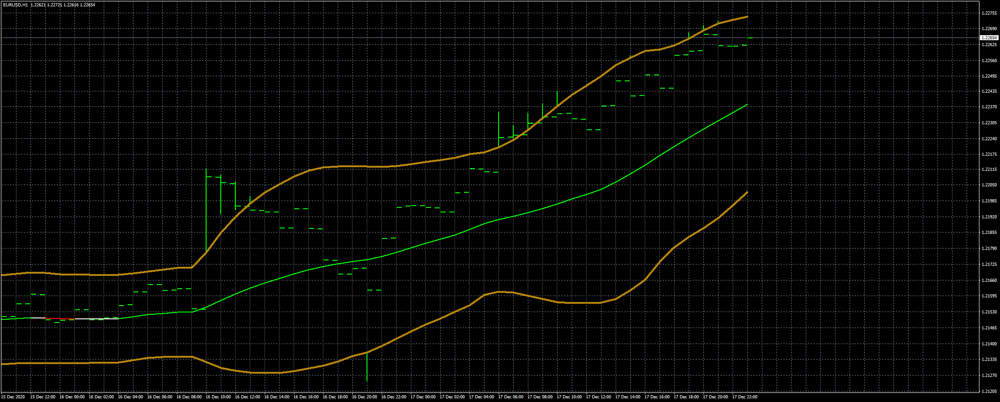

# BB_Analyzer EA

> Source: https://fxcodebase.com/code/viewtopic.php?f=38&t=71322  
> Forum: 38 · Topic 71322 · 5 post(s)

---

## BB_Analyzer EA

**Apprentice** · Tue Jul 06, 2021 3:12 am

Based on the request.
[https://fxcodebase.com/code/viewtopic.php?f=38&t=71291](https://fxcodebase.com/code/viewtopic.php?f=38&t=71291)

 [BB_Analyzer.mq4](files/142696/BB_Analyzer.mq4)

 [BB_Analyzer EA.mq4](files/142696/BB_Analyzer%20EA.mq4)

---

## Re: BB_Analyzer EA

**doodlebug** · Sat Aug 21, 2021 2:51 am

Hi
I have been testing the EA but there seems to be a small error as soon as you select atr as a preference for example in the SL setting then the EA only trades LONG please check
thanks.

---

## Re: BB_Analyzer EA

**Apprentice** · Mon Aug 23, 2021 3:06 am

Your request is added to the development list.
Development reference 764.

---

## Re: BB_Analyzer EA

**Apprentice** · Tue Aug 24, 2021 3:20 am

Try it now.

---

## Re: BB_Analyzer EA

**doodlebug** · Wed Sep 01, 2021 8:33 am

All good many thx working through set files
