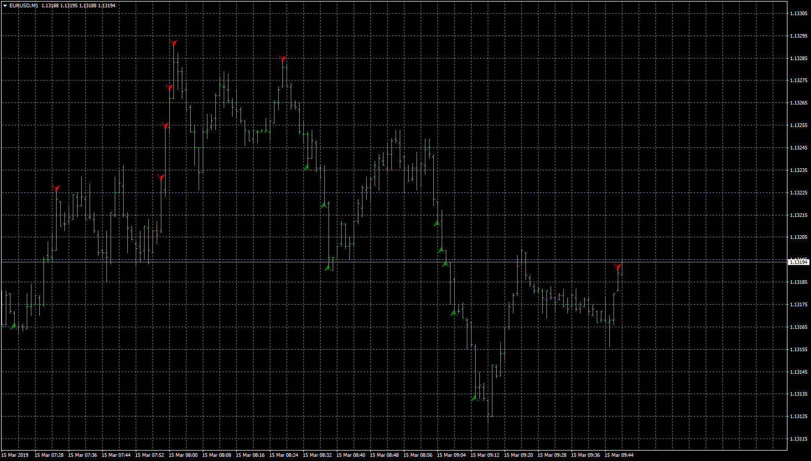

# BB Arrow LTF

> Source: https://fxcodebase.com/code/viewtopic.php?f=38&t=67450  
> Forum: 38 · Topic 67450 · 15 post(s)

---

## BB Arrow LTF

**Apprentice** · Fri Mar 15, 2019 6:45 am

Based on request.
[viewtopic.php?f=38&t=67408](https://fxcodebase.com/code/viewtopic.php?f=38&t=67408)

 [BB Arrow LTF.mq4](files/124446/BB%20Arrow%20LTF.mq4)

---

## Re: BB Arrow LTF

**Sp2562** · Sun Apr 07, 2019 9:27 pm

Hello friends.

I need a correction on this indicator.

He is not looking crazy as the candle goes through the band. It only appears if I change the graph time from M1 to M5 and then back to M1.

Please correct the indicator so that the arrow appears when the band is playing.

---

## Re: BB Arrow LTF

**Apprentice** · Tue Apr 09, 2019 5:42 am

Your request is added to the development list under Id Number 4586

---

## Re: BB Arrow LTF

**Apprentice** · Tue Apr 16, 2019 4:59 am

Fixed.

---

## Re: BB Arrow LTF

**Sp2562** · Wed Apr 17, 2019 2:00 pm

Perfect, you guys are the best !!!

---

## Re: BB Arrow LTF

**Sp2562** · Thu May 09, 2019 7:48 pm

Remove the time limit for this indicator.

I need to see him for about a year.

---

## Re: BB Arrow LTF

**Apprentice** · Mon May 13, 2019 4:07 am

There is a parameter for that: "Bars limit". Set it to 1000000

---

## Re: BB Arrow LTF

**Sp2562** · Tue May 21, 2019 5:53 pm

Hello friends.

I am asking for a small adjustment on this indicator.

This indicator is not allowing you to see arrows behind this time.

Please remove the "Bar Limit" field because even placing with 1000000 it limits the view.

---

## Re: BB Arrow LTF

**Sp2562** · Sat May 25, 2019 3:28 pm

Dear friends, please give priority in this development, since I need to perform the backtest of this indicator for 2 years.

This way I can not do tests with deadlines of some years.

Thank you very much for your attention and dedication.

---

## Re: BB Arrow LTF

**Apprentice** · Tue May 28, 2019 3:42 pm

there is nothing in the code which can limit it.

---

## Re: BB Arrow LTF

**Sp2562** · Tue May 28, 2019 3:46 pm

I understand.

But why is it limited?

Is there any reason?

Can not solve it?

---

## Re: BB Arrow LTF

**Sp2562** · Wed Jun 05, 2019 9:34 am

Put this button on the "LTFBB" indicator.

I want it to disappear and show up when I click the button.

---

## Re: BB Arrow LTF

**Apprentice** · Thu Jun 06, 2019 6:02 am

Your request is added to the development list under Id Number 4702

---

## Re: BB Arrow LTF

**Apprentice** · Sat Jun 08, 2019 2:31 am

Try this version.

---

## Re: BB Arrow LTF

**Sp2562** · Sat Jun 08, 2019 2:10 pm

Perfect thank you.
