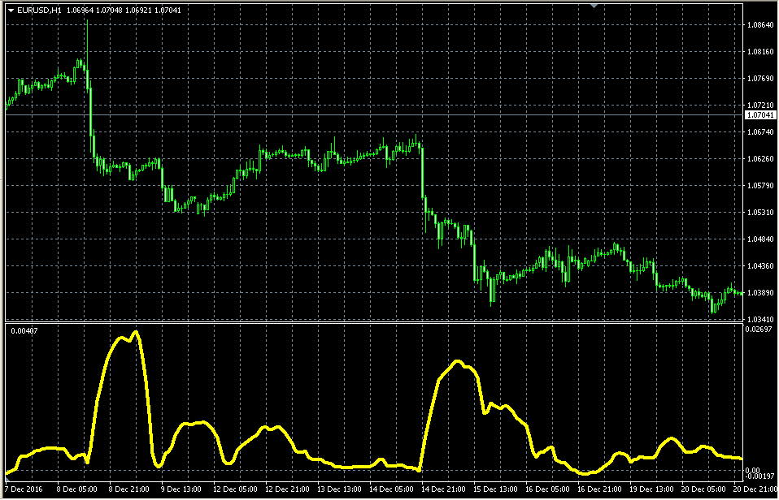

# BB ATR oscillator

> Source: https://fxcodebase.com/code/viewtopic.php?f=38&t=64336  
> Forum: 38 · Topic 64336 · 1 post(s)

---

## BB ATR oscillator

**Alexander.Gettinger** · Wed Jan 25, 2017 1:18 pm

Formula:
BB_ATR=BB_U-BB_L-ATR*ATR_Multiplier, where
BB_U, BB_L - upper and lower line of Bollinger Bande with [BB_Length] number of periods and [BB_Deviation] deviation,
ATR - average true range with [ATR_Length] number of periods.

 

Download:

 [BB_ATR_Oscillator.mq4](files/110702/BB_ATR_Oscillator.mq4)
