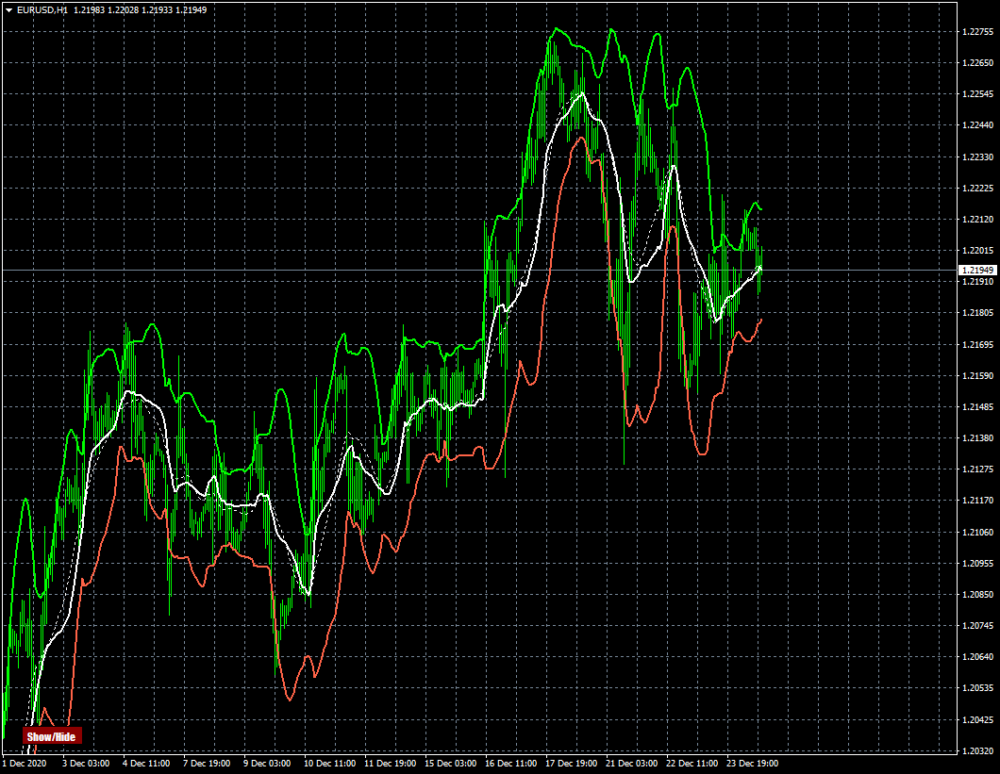

# BB-et-vwap

> Source: https://fxcodebase.com/code/viewtopic.php?f=38&t=70746  
> Forum: 38 · Topic 70746 · 11 post(s)

---

## BB-et-vwap

**Apprentice** · Thu Dec 24, 2020 7:00 am

Based on request.
[viewtopic.php?f=27&t=70736](https://fxcodebase.com/code/viewtopic.php?f=27&t=70736)

 [BB-et-vwap.mq4](files/139761/BB-et-vwap.mq4)

---

## Re: BB-et-vwap

**drudominique** · Fri Dec 25, 2020 1:08 am

Hello,
Thank you very much it works perfectly, I will try to understand your code in order to do the same on other indicators.
A BIG VERY BIG thank you.
I wish you happy holidays and lots of good things for you and your family.
Sincerely

FRENCH

Bonjour,
Je vous remercie beaucoup cela fonctionne parfaitement , je vais essayer de comprendre votre code afin de faire la même chose sur d'autre indicateurs .
UN GRANG TRES GRAND merci .
je vous souhaite de bonnes fêtes et plein de bonnes choses pour vous et votre famille .
cordialement

---

## Re: BB-et-vwap

**drudominique** · Fri Dec 25, 2020 1:42 am

Just one little thing.
copy screen 1 you will notice at the bottom of the screen nothing special, on copy screen 2 when I erase my indicator a horizontal blue line appears, do you know why ?
I don't mind to trade but as I'm on a real account with my own strategy I don't want to take any risk.
Thank you for your advice.
Sincerely

---

## Re: BB-et-vwap

**Apprentice** · Fri Dec 25, 2020 4:18 am

Your request is added to the development list.
Development reference 2530.

---

## Re: BB-et-vwap

**Apprentice** · Sat Dec 26, 2020 5:57 am

Try it now.

---

## Re: BB-et-vwap

**drudominique** · Sat Dec 26, 2020 11:55 am

where is he?
cordially

---

## Re: BB-et-vwap

**drudominique** · Sat Dec 26, 2020 11:58 am

sorry I found
thank you it works perfectly
cordially

---

## Re: BB-et-vwap

**drudominique** · Sat Dec 26, 2020 12:03 pm

another question .
In the same indicator I would like to add a JSmooth_MA, I tried to put the code in the BB VWAP but nothing to make the curve does not appear I do not understand how you do, I am a beginner in prog.
so you can put this indicator in my BB VWAP.

thank you very much

French

autre question .
Dans le même indicateur je voudrais ajouter une JSmooth_MA , j'ai essayé de mettre le code dans le BB VWAP mais rien a faire la courbe n'apparait pas je comprends pas comment vous faites , je suis débutant en prog .
donc pouvez vous mettre cet indicateur dans mon BB VWAP .

merci beaucoup

---

## Re: BB-et-vwap

**Apprentice** · Sun Dec 27, 2020 3:33 pm

Your request is added to the development list.
Development reference 2538.

---

## Re: BB-et-vwap

**Apprentice** · Mon Dec 28, 2020 3:34 pm

[BB-et-vwap.mq4](files/139844/BB-et-vwap.mq4)

Try this version.

---

## Re: BB-et-vwap

**drudominique** · Tue Dec 29, 2020 12:46 am

Hello
no that is not good, the BB is totally wrong, the JS curve does not appear.
but it is not serious, your BB Vwap is him perfect (1st version) the JS I put it as a single indicator.
so thank you very much not worth wasting your time with it.
thank you very much
