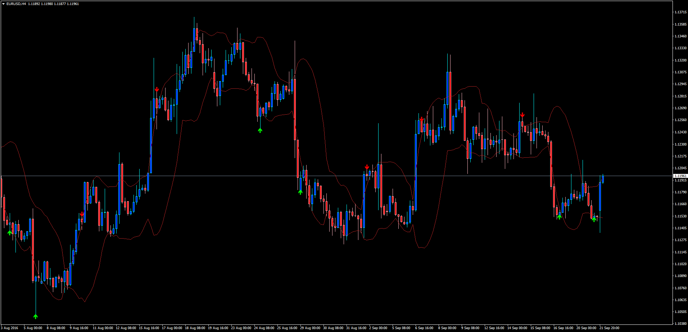

# BB_OutsideCandle_Alert

> Source: https://fxcodebase.com/code/viewtopic.php?f=38&t=63887  
> Forum: 38 · Topic 63887 · 9 post(s)

---

## BB_OutsideCandle_Alert

**Apprentice** · Thu Sep 22, 2016 3:33 am

Based on request.
[viewtopic.php?f=27&t=60852](https://fxcodebase.com/code/viewtopic.php?f=27&t=60852)

This indicators will display the historical signals produced by any bearish candle opening and closing outside the top bollinger band for a short signal and any bullish candle opening and closing outside the bottom bollinger band for a long signal.

It will also display a sound and visual alert if the condition is met after the last close (the previous candle before the current one).

Customizable colors and displays.

 [BB_OutsideCandle_Alert.mq4](files/108224/BB_OutsideCandle_Alert.mq4)

 [BB_Outside_EA_v1.00.mq4](files/108224/BB_Outside_EA_v1.00.mq4)

---

## Re: BB_OutsideCandle_Alert

**dannyboybet247** · Sun Oct 16, 2016 5:23 pm

is it possible to have the indictor alert when a candle closes outside of the bb from inside and place arrow on open of next candle

---

## Re: BB_OutsideCandle_Alert

**Apprentice** · Tue Oct 18, 2016 7:51 am

Your request is added to the development list, Under Id Number 3653
 If someone is interested to do this task, please contact me.

---

## Re: BB_OutsideCandle_Alert

**Apprentice** · Tue Nov 01, 2016 4:08 am

Feature added to permit the signals when a candle closes outside the bands while opening inside. Please note that to have valid signals with this method (Mode_Inside_Out = true) the standard deviation should be increased to greater than 2.

---

## Re: BB_OutsideCandle_Alert

**BADO35** · Thu Oct 24, 2019 8:25 am

> **Apprentice wrote:**
> Feature added to permit the signals when a candle closes outside the bands while opening inside. Please note that to have valid signals with this method (Mode_Inside_Out = true) the standard deviation should be increased to greater than 2.

dear Apprentice, i am looking exactly for this indicator (BB indicator incl. alert triggered when candle close outside band). however i could not find the indicator as you have mentioned in your reply. i am new member, please help

---

## Re: BB_OutsideCandle_Alert

**Apprentice** · Sun Oct 27, 2019 4:47 am

BB_OutsideCandle_Alert.mq4 First post on the topic.

---

## Re: BB_OutsideCandle_Alert

**LuckyLucos** · Fri Jan 27, 2023 4:37 pm

Hello Apprentice.

Could it be possible to make an EA with this indicator?

Entry for buy:
Buy when candle's low cross below the Low Bollinger Band.
SL 5 pips below candle's low.
TP at the Middle Bollinger Band.

Entry fo sell:
Sell when candle's high cross above the Upper Bollinger Band.
SL 5 pips above candle's high.
TP at the Middle Bollinger Band.

And, if possible, only entries for buying and selling when the price is in a squeeze zone.

Thanks.

---

## Re: BB_OutsideCandle_Alert

**Apprentice** · Tue Jan 31, 2023 6:37 am

We have added your request to the development list.
Development reference 97.

---

## Re: BB_OutsideCandle_Alert

**Apprentice** · Wed May 29, 2024 8:59 am

BB_Outside_EA_v1.00.mq4 added.
