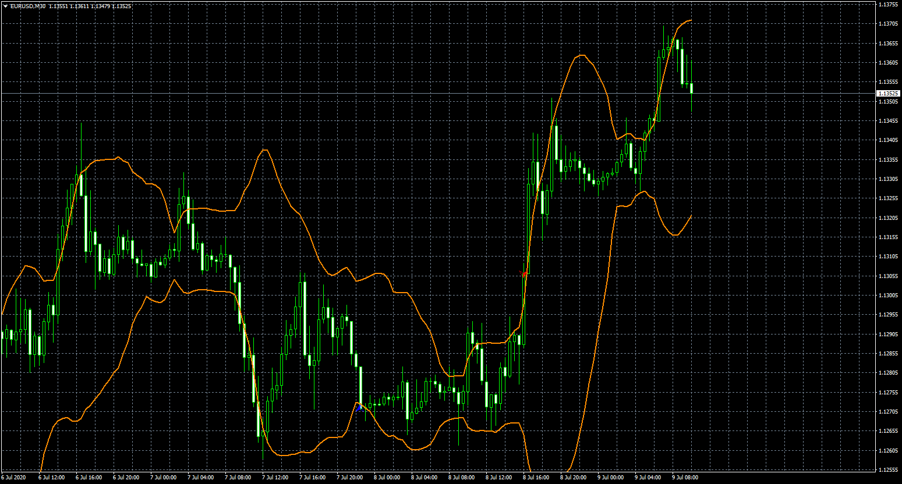

# BB with shadow filter

> Source: https://fxcodebase.com/code/viewtopic.php?f=38&t=70150  
> Forum: 38 · Topic 70150 · 8 post(s)

---

## BB with shadow filter

**Apprentice** · Thu Jul 09, 2020 4:02 am

TS2/Lua version.
[viewtopic.php?f=17&t=70141](https://fxcodebase.com/code/viewtopic.php?f=17&t=70141)

 [BB with shadow filter.mq4](files/135773/BB%20with%20shadow%20filter.mq4)

 [BB with shadow filter.mq5](files/135773/BB%20with%20shadow%20filter.mq5)

---

## Re: BB with shadow filter

**dotori** · Thu Jul 09, 2020 6:57 am

Thanks a million!
Great Job.

Now I would like to know if you could also add the Stochastic Osciallator?
With changeable parameters.
Or is it added? I could not find.
Would that be possible?

Stochastic Oscillator:
K: 7
D: 3
Slowing: 3
Mode: Exponential
Price : close/close
overbought: 70
oversold : 30

And can you also add the time filter? As I already asked...

like this:
[http://prnt.sc/tcx9ny](http://prnt.sc/tcx9ny)

---

## Re: BB with shadow filter

**Apprentice** · Thu Jul 09, 2020 7:52 am

Please provide rules for the Stochastic Oscillator,
can you define the time filter?

---

## Re: BB with shadow filter

**dotori** · Thu Jul 09, 2020 8:45 am

Hi,

just as Bollinger Bands Parameter
if the below parameters are matched, and only if both BB AND
SO Paremeters are matched, the signals should appear.
And i want to be able to change the below parameters, just like i can change the parameters of BB

Stochastic Oscillator:
K: 7
D: 3
Slowing: 3
Mode: Exponential
Price : close/close
overbought: 70
oversold : 30

Time Filter is just like in the screen shot.
I only want to trade during the time period i can define in the time filter.
Should be either same as MT terminal time or PC time.

Thank you

[http://prnt.sc/tcx9ny](http://prnt.sc/tcx9ny)

---

## Re: BB with shadow filter

**Apprentice** · Fri Jul 10, 2020 4:43 am

Please provide rules for Stochastic

Will we use OB/OS od K/D line relation.

If OB/OS
A)Will will open Long in OB zone, or vice versa.
B)Will will open Long in OS zone, or vice versa.
If K/D
C) Will will open Long in K > D
D) Will will open Long in K < D

---

## Re: BB with shadow filter

**dotori** · Fri Jul 10, 2020 6:31 am

Hi, Please OB/OS and open long in OB zone.

Time Zone Filter can be done?

Thank you

---

## Re: BB with shadow filter

**Apprentice** · Sat Jul 11, 2020 4:07 pm

Your request is added to the development list.
Development reference 1671.

---

## Re: BB with shadow filter

**Apprentice** · Tue Jul 14, 2020 7:44 am

[BB with shadow filter.mq4](files/135954/BB%20with%20shadow%20filter.mq4)

Try this version.
