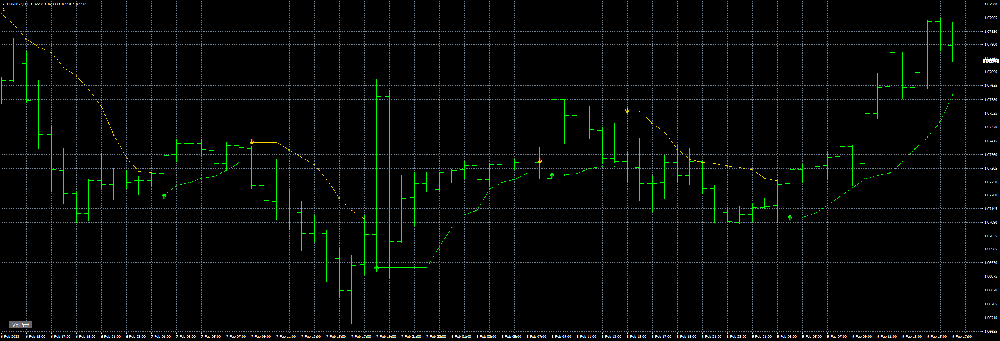
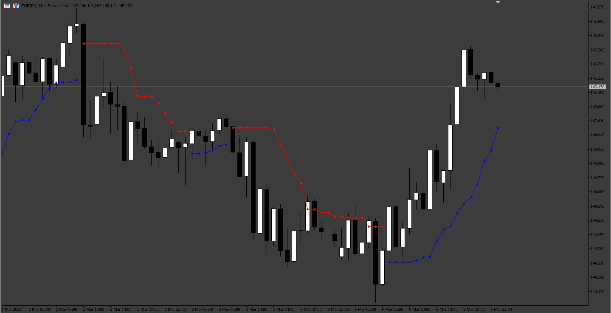

# BBand_Stop_Alert

> Source: https://fxcodebase.com/code/viewtopic.php?f=38&t=73356  
> Forum: 38 · Topic 73356 · 4 post(s)

---

## BBand_Stop_Alert

**Apprentice** · Thu Feb 09, 2023 10:27 am

Based on the request.
[https://fxcodebase.com/code/viewtopic.php?f=38&t=73309](https://fxcodebase.com/code/viewtopic.php?f=38&t=73309)

 [BBand_Stop_Alert.mq4](files/149568/BBand_Stop_Alert.mq4)

 

 [BBand_Stop_MT5.mq5](files/149568/BBand_Stop_MT5.mq5)

---

## Re: BBand_Stop_Alert

**mhlangak** · Fri Mar 03, 2023 2:59 am

Please Convert indicator to Mt5

---

## Re: BBand_Stop_Alert

**Apprentice** · Sun Mar 05, 2023 7:06 pm

We have added your request to the development list.
Development reference 223.

---

## Re: BBand_Stop_Alert

**Apprentice** · Sat Mar 11, 2023 3:20 am

BBand_Stop_MT5.mq5 added.
