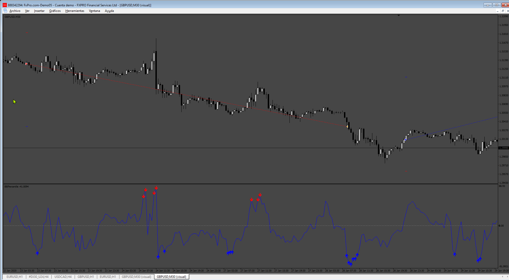
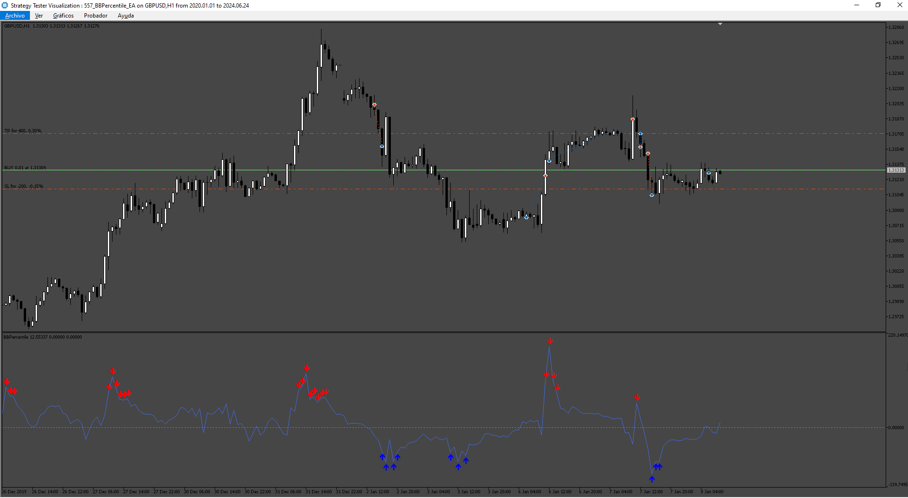

# BBPercentile_EA

> Source: https://fxcodebase.com/code/viewtopic.php?f=38&t=75046  
> Forum: 38 · Topic 75046 · 8 post(s)

---

## BBPercentile_EA

**Apprentice** · Mon Jul 08, 2024 2:28 pm

Based on the request.
[https://fxcodebase.com/code/viewtopic.p ... 45#p155945](https://fxcodebase.com/code/viewtopic.php?f=27&p=155945#p155945)

 [BBPercentile.ex4](files/156068/BBPercentile.ex4)

 [BBPercentile_EA.mq4](files/156068/BBPercentile_EA.mq4)

 

 [BBPercentile.mq5](files/156068/BBPercentile.mq5)

 [BBPercentile_EA.mq5](files/156068/BBPercentile_EA.mq5)

---

## Re: BBPercentile_EA

**trtrader** · Mon Jul 08, 2024 2:46 pm

Please upload the indicator as well.

thanks

---

## Re: BBPercentile_EA

**Relebohile12** · Tue Jul 09, 2024 4:55 pm

Requesting MT5 indicator and EA for this MT4 EA

---

## Re: BBPercentile_EA

**xmixers** · Wed Jul 10, 2024 1:13 am

is there inficator file?, sorry i dont see it

---

## Re: BBPercentile_EA

**Relebohile12** · Fri Jul 12, 2024 6:03 am

Requesting indicator for this EA, and please convet it to mt5.

---

## Re: BBPercentile_EA

**Apprentice** · Sat Jul 13, 2024 1:39 am

We have added your request to the development list.
Development reference 557

---

## Re: BBPercentile_EA

**Apprentice** · Wed Jul 17, 2024 4:27 pm

BBPercentile.ex4 added.

---

## Re: BBPercentile_EA

**Apprentice** · Sat Jul 20, 2024 8:36 am

BBPercentile_EA.mq5 added.
