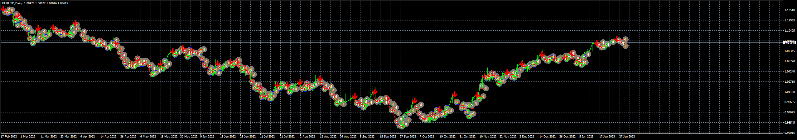

# Be_forex_guru_EA

> Source: https://fxcodebase.com/code/viewtopic.php?f=38&t=73302  
> Forum: 38 · Topic 73302 · 5 post(s)

---

## Be_forex_guru_EA

**Apprentice** · Tue Jan 31, 2023 12:53 pm

Based on the request.
[https://fxcodebase.com/code/viewtopic.php?f=27&p=149321](https://fxcodebase.com/code/viewtopic.php?f=27&p=149321)

 [be-forex-guru-indicator.mq4](files/149399/be-forex-guru-indicator.mq4)

 [Be_forex_guru_EA_v1.00.mq4](files/149399/Be_forex_guru_EA_v1.00.mq4)

 [be-forex-guru-indicator.mq5](files/149399/be-forex-guru-indicator.mq5)

---

## Re: Be_forex_guru_EA

**mhlangak** · Sat Mar 18, 2023 5:05 pm

Please coders convert this indicator

be-forex-guru-indicator.mq4

To MT5 indicator

---

## Re: Be_forex_guru_EA

**Apprentice** · Mon Mar 20, 2023 10:37 am

We have added your request to the development list.
Development reference 254.

---

## Re: Be_forex_guru_EA

**quintana** · Fri Mar 31, 2023 2:45 pm

one more possibility

using a second sensitivity curve
for filter buy or shell orders
for example if sensibility is 6 we can filter with a 34 sensibility making only by orders if price if over sensibility 34 and shell orders only if price is under the 34 sensibility.

i work with this system on the 1 mn

seems interesting

thanks

---

## Re: Be_forex_guru_EA

**Apprentice** · Wed Jul 03, 2024 11:39 am

be-forex-guru-indicator.mq5 added.
