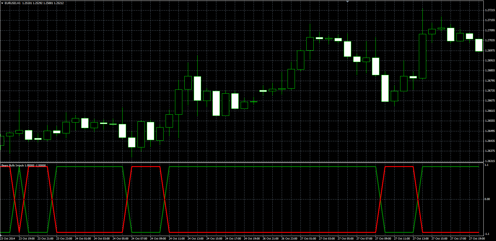

# Bears Bulls Impuls

> Source: https://fxcodebase.com/code/viewtopic.php?f=38&t=61467  
> Forum: 38 · Topic 61467 · 1 post(s)

---

## Bears Bulls Impuls

**Alexander.Gettinger** · Tue Nov 18, 2014 11:52 am

Original LUA oscillator: [viewtopic.php?f=17&t=20561](https://fxcodebase.com/code/viewtopic.php?f=17&t=20561).

Indicator is based on the Elder-Rays Bulls & Bears Power indicators.

Formulas:
Bulls = 1 and Bears = -1, if BullIndex+BearIndex>0,
Bulls = -1 and Bears = 1, if BullIndex+BearIndex<0, where
BullIndex = High - EMA(Price),
BearIndex = Low - EMA(Price).

 

Download:

 [Bears_Bulls_Impuls.mq4](files/97160/Bears_Bulls_Impuls.mq4)
