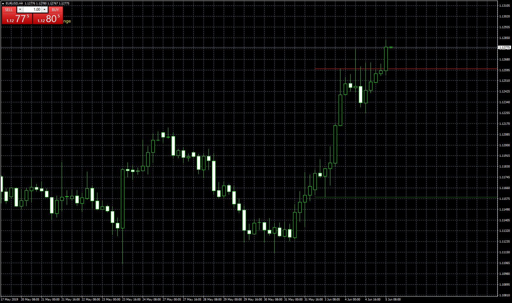

# Beginning of Week Psych Level

> Source: https://fxcodebase.com/code/viewtopic.php?f=38&t=68538  
> Forum: 38 · Topic 68538 · 2 post(s)

---

## Beginning of Week Psych Level

**Apprentice** · Wed Jun 05, 2019 5:57 am

Based on request.
[viewtopic.php?f=27&t=68522](https://fxcodebase.com/code/viewtopic.php?f=27&t=68522)

 [Beginning of Week Psych Level.mq4](files/126729/Beginning%20of%20Week%20Psych%20Level.mq4)

---

## Re: Beginning of Week Psych Level

**Pro Retail Trader** · Wed Jun 05, 2019 12:44 pm

Thank you Apprentice,

The indicator works perfect so far. I am going to wait until the end of the week and see what the "extend lines" option does.

This is an important concept for traders that I want to teach and help implement in their trading. You have done the trading community a wonderful service! Thank you again.
