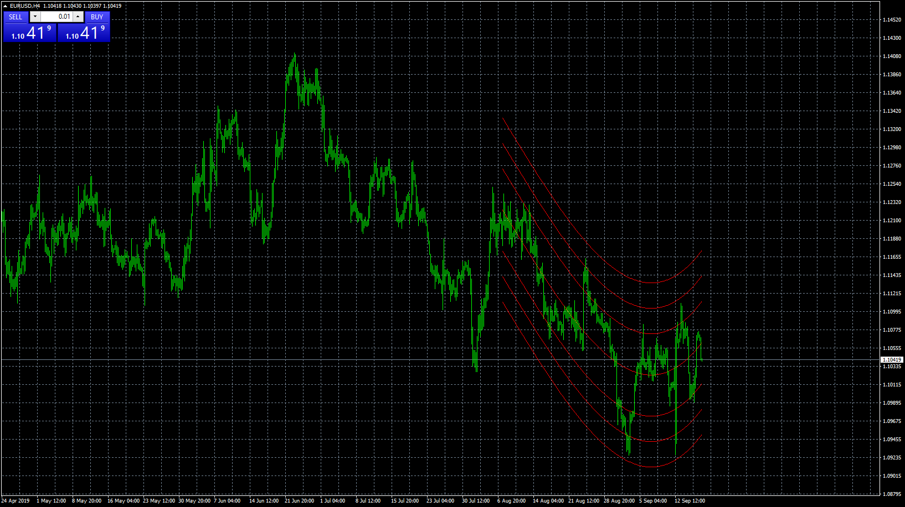

# BELCOG

> Source: https://fxcodebase.com/code/viewtopic.php?f=38&t=68929  
> Forum: 38 · Topic 68929 · 7 post(s)

---

## BELCOG

**Apprentice** · Wed Sep 18, 2019 6:03 am

TS2/Lua version.
[viewtopic.php?f=17&t=706](https://fxcodebase.com/code/viewtopic.php?f=17&t=706)

 [BELCOG.mq4](files/128740/BELCOG.mq4)

 [BELCOG.mq5](files/128740/BELCOG.mq5)

---

## Re: BELCOG

**RummanC** · Tue Jul 14, 2020 8:21 am

Hi Apprentice,

Would it be possible to get an MT5 version of this?

Kind regards
R

---

## Re: BELCOG

**Apprentice** · Wed Jul 15, 2020 9:59 am

Your request is added to the development list.
Development reference 1696.

---

## Re: BELCOG

**Apprentice** · Fri Jul 17, 2020 5:22 am

BELCOG.mq5 added.

---

## Re: BELCOG

**AndrewOcconer** · Fri Jul 17, 2020 7:34 pm

> **Apprentice wrote:**
> BELCOG.mq5 added.

Indicator disappears when new candle/bar open

---

## Re: BELCOG

**Apprentice** · Sun Jul 19, 2020 5:12 pm

Your request is added to the development list.
Development reference 1725.

---

## Re: BELCOG

**RummanC** · Sun Jul 26, 2020 9:51 am

> **Apprentice wrote:**
> Your request is added to the development list.
> Development reference 1725.

Muchas gracias!

I have ported over the supplementary timing indicator to MT5 if that is of any use to anyone.

Kind regards
R
