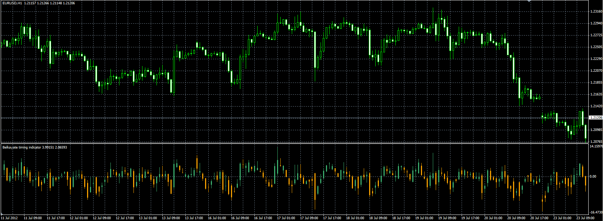

# Belkhayate's Timing Indicator

> Source: https://fxcodebase.com/code/viewtopic.php?f=38&t=21219  
> Forum: 38 · Topic 21219 · 4 post(s)

---

## Belkhayate's Timing Indicator

**Alexander.Gettinger** · Mon Jul 23, 2012 10:05 am

Original indicator: [viewtopic.php?f=17&t=715](https://fxcodebase.com/code/viewtopic.php?f=17&t=715)

 

Download:

 [Beltime.mq4](files/37160/Beltime.mq4)

---

## Re: Belkhayate's Timing Indicator

**Kinslay** · Thu Apr 14, 2022 8:29 am

Hello Apprendice,

The "Beltime" indicator is not working for mt4, can you update the file please?

Thakyou

---

## Re: Belkhayate's Timing Indicator

**Apprentice** · Tue Apr 19, 2022 9:32 am

Your request is added to the development list.
Development reference 252.

---

## Re: Belkhayate's Timing Indicator

**Apprentice** · Fri Apr 22, 2022 4:20 am

Try it now.
