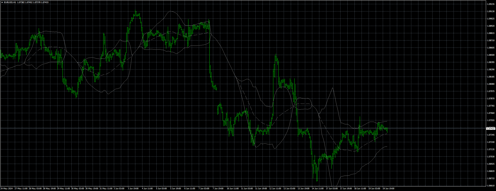
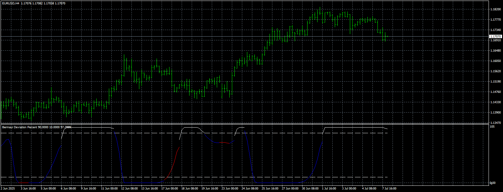

# Bermaui_Bands

> Source: https://fxcodebase.com/code/viewtopic.php?f=38&t=74987  
> Forum: 38 · Topic 74987 · 8 post(s)

---

## Bermaui_Bands

**Apprentice** · Wed Jun 19, 2024 4:41 pm

Based on the request.
[https://fxcodebase.com/code/viewtopic.php?f=38&t=74961](https://fxcodebase.com/code/viewtopic.php?f=38&t=74961)

 [Bermaui_Bands.mq4](files/155823/Bermaui_Bands.mq4)

---

## Re: Bermaui_Bands

**Teruyoshi** · Sun Jun 23, 2024 2:57 am

Thanks for sharing a wonderful indicator.
 I think it would be of help to add arrows like the link below.
[https://www.mql5.com/ja/market/product/ ... e=External](https://www.mql5.com/ja/market/product/16251?source=External)
Would you mind modifing?
 Many thanks in advance.

---

## Re: Bermaui_Bands

**Apprentice** · Sun Jun 23, 2024 3:14 pm

We have added your request to the development list.
Development reference 511

---

## Re: Bermaui_Bands

**Apprentice** · Tue Jun 25, 2024 1:07 pm

[Bermaui_Bands_Arrows.mq4](files/155922/Bermaui_Bands_Arrows.mq4)

Try this version.

---

## Re: Bermaui_Bands

**sathistrader** · Sat Jul 13, 2024 1:34 pm

Nice. Thanks a lot

---

## Re: Bermaui_Bands

**Teruyoshi** · Thu Sep 04, 2025 11:03 pm

Could you turn this indi into mq4 when it is convinient for you?
So much thanks in advance. I am looking forward to your reply.
 [https://www.tradingview.com/script/MMGF ... n-Percent/](https://www.tradingview.com/script/MMGFziZ0-Bermaui-Deviation-Percent/)

---

## Re: Bermaui_Bands

**Apprentice** · Mon Sep 08, 2025 6:04 am

We have added your request to the development list.
Development reference 575

---

## Re: Bermaui_Bands

**Apprentice** · Wed Sep 17, 2025 5:21 am

 [Bermaui_Deviation_Percent.mq4](files/160567/Bermaui_Deviation_Percent.mq4)
