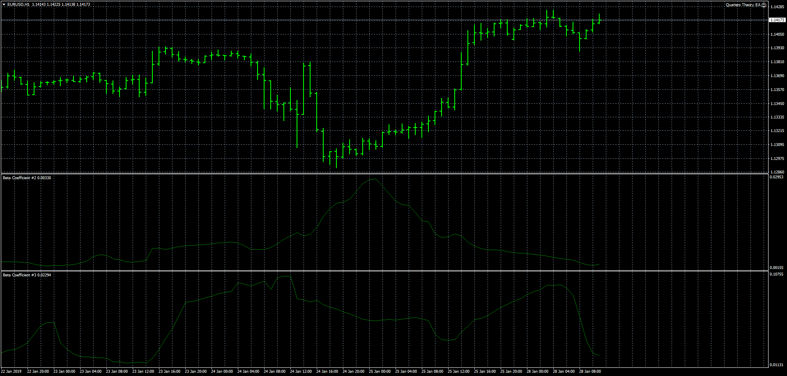

# Beta Coefficient

> Source: https://fxcodebase.com/code/viewtopic.php?f=38&t=67304  
> Forum: 38 · Topic 67304 · 3 post(s)

---

## Beta Coefficient

**Apprentice** · Mon Jan 28, 2019 8:16 am

Based on TS2/Lua version
[viewtopic.php?f=17&t=67303](https://fxcodebase.com/code/viewtopic.php?f=17&t=67303)

 [Beta Coefficient.mq4](files/123559/Beta%20Coefficient.mq4)

 [Beta Coefficient List.mq4](files/123559/Beta%20Coefficient%20List.mq4)

---

## Re: Beta Coefficient

**logicgate** · Sat Aug 17, 2019 11:58 am

Hi there my friend. A couple of problems with the indicators. I have attached screenshots with annotations.

---

## Re: Beta Coefficient

**Apprentice** · Mon Aug 19, 2019 6:31 am

Try it now.
