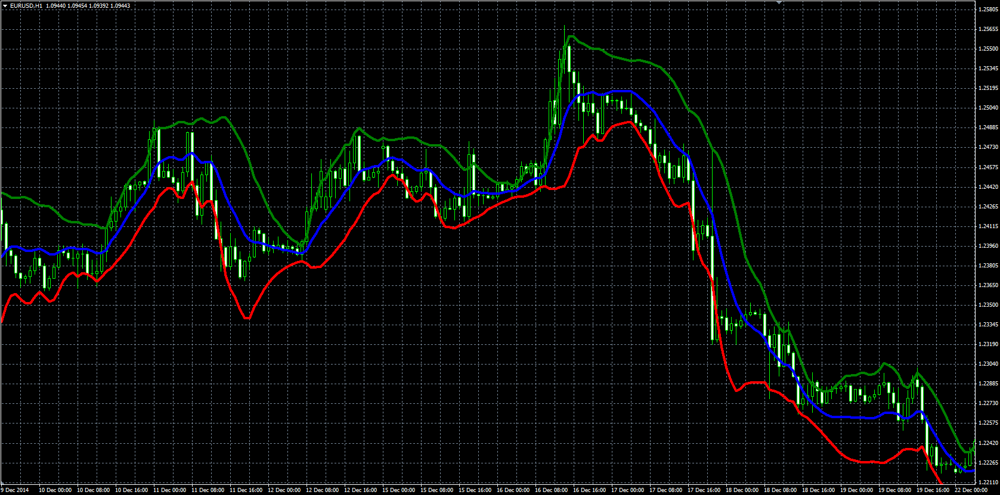

# Better Bollinger Band

> Source: https://fxcodebase.com/code/viewtopic.php?f=38&t=62081  
> Forum: 38 · Topic 62081 · 1 post(s)

---

## Better Bollinger Band

**Alexander.Gettinger** · Wed Apr 08, 2015 10:17 am

Original LUA indicator: [viewtopic.php?f=17&t=61115](https://fxcodebase.com/code/viewtopic.php?f=17&t=61115).

Formulas:
Central[i] = ((2-Alpha)*mt[i]-ut[i])/(1-Alpha),
Top[i] = Central[i]+Deviation*dt2,
Bottom[i] = Central[i]-Deviation*dt2, where
mt[i] = Alpha*Median+(1-Alpha)*mt[i-1],
ut[i] = Alpha*mt[i]+(1-Alpha)*ut[i-1],
Median = (High+Low)/2,
dt2[i] = ((2-Alpha)*mt2[i]-ut2[i])/(1-Alpha),
mt2[i] = Alpha*Abs(Median-Central[i])+(1-Alpha)*mt2[i-1],
ut2[i] = Alpha*mt2[i]+(1-Alpha)*ut2[i-1],
Alpha = 2/(1+Lenght).

 

Download:

 [Better_Bollinger_Band.mq4](files/99667/Better_Bollinger_Band.mq4)
