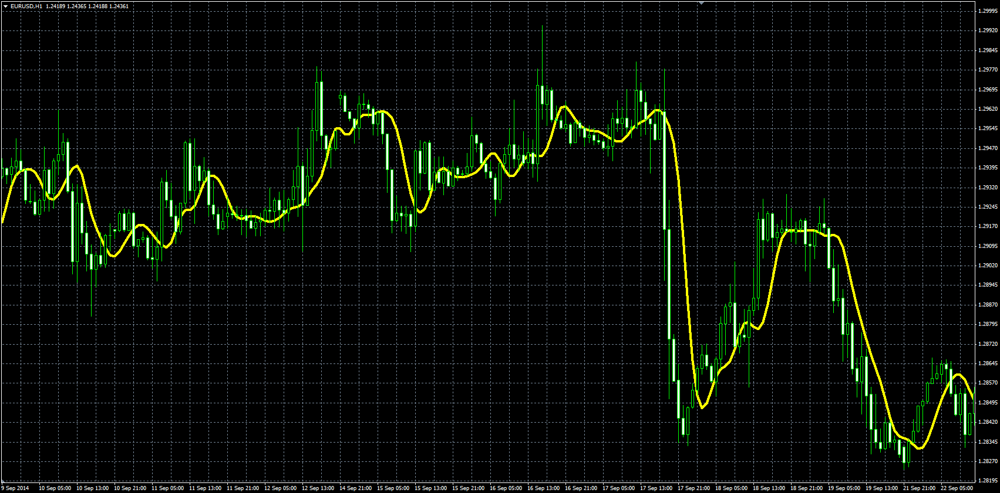

# Bezier MA indicator

> Source: https://fxcodebase.com/code/viewtopic.php?f=38&t=61546  
> Forum: 38 · Topic 61546 · 1 post(s)

---

## Bezier MA indicator

**Alexander.Gettinger** · Wed Nov 26, 2014 3:14 pm

Bezier-weighting MA.

Formula:
Bezier[i] = Sum(Price*Coeff) at range from (i-Length+1) to (i), where
Coeff = (Length!/(i!*(Length-i)!))*Sensitivity^i*(1-Sensitivity)^(Length-i),
N! - Factorial of N.

 

Download:

 [Bezier.mq4](files/97392/Bezier.mq4)
