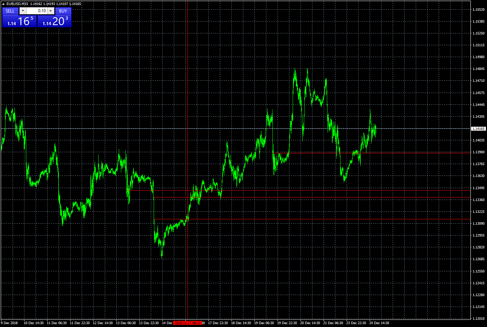

# Big_Candle

> Source: https://fxcodebase.com/code/viewtopic.php?f=38&t=67202  
> Forum: 38 · Topic 67202 · 1 post(s)

---

## Big_Candle

**Apprentice** · Tue Dec 25, 2018 5:42 am

Based on request.
[viewtopic.php?f=27&p=123004](https://fxcodebase.com/code/viewtopic.php?f=27&p=123004)
Draws a horizontal line or arrow if the current candle has a range greater then the multiple of average candle range.

 [Big_Candle.mq4](files/123033/Big_Candle.mq4)
