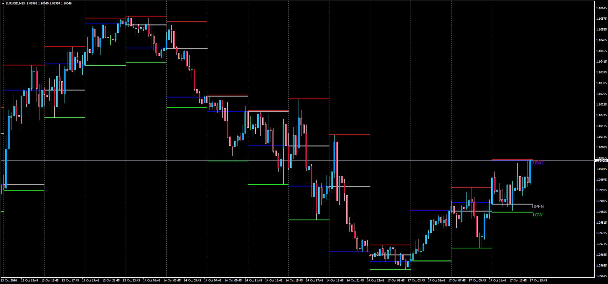
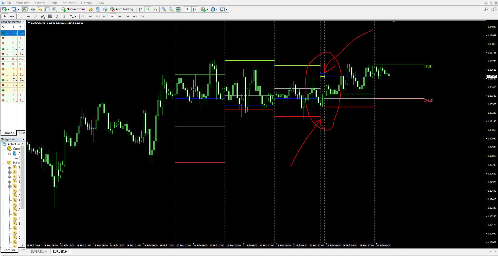
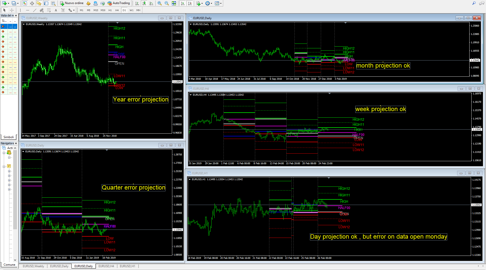

# Biger Time Frame High/Low (BTF Source)

> Source: https://fxcodebase.com/code/viewtopic.php?f=38&t=63985  
> Forum: 38 · Topic 63985 · 25 post(s)

---

## Biger Time Frame High/Low (BTF Source)

**Apprentice** · Mon Oct 17, 2016 1:56 pm

Bigger Time Frame Source (BTF Source)

Original LUA: [viewtopic.php?f=17&t=2213](https://fxcodebase.com/code/viewtopic.php?f=17&t=2213)

Displays open, close, high and low Price values for Biger Time Frames. Giving us HTF Candle or Higher Time Frame overlay.

Option to select various bigger time frames from 5-min (if seen in a M1 chart) to Monthly TF.

Available MT4 Time Frames: M5, M15, M30, H1, H4, D1, W1, MN1.

Note: The Time Frame where the indicator is plot has to be lower than the selected TF - otherwise an alert will sound letting you know you need to change the TF.

Customizable colors and options. BTF separator (vertical line) included as well.

Picture Example: M15 Chart using M240 TF as source.

 [BTF_Source.mq4](files/108635/BTF_Source.mq4)

---

## Re: Biger Time Frame High/Low (BTF Source)

**syncoopate** · Fri Feb 15, 2019 2:38 pm

Hi, you can also enter the quarter and year.
 thanks a lot

---

## Re: Biger Time Frame High/Low (BTF Source)

**Apprentice** · Sat Feb 16, 2019 3:12 am

Your request is added to the development list under Id Number 4479

---

## Re: Biger Time Frame High/Low (BTF Source)

**Apprentice** · Mon Feb 18, 2019 5:43 am

Try this version.

 [BTF_Source v.1.1.mq4](files/123978/BTF_Source%20v.1.1.mq4)

---

## Re: Biger Time Frame High/Low (BTF Source)

**syncoopate** · Tue Feb 19, 2019 9:39 am

thanks a lot ... but I do not see year time frame ??

---

## Re: Biger Time Frame High/Low (BTF Source)

**Apprentice** · Mon Feb 25, 2019 5:40 pm

Fixed.

 [BTF_Source v.1.2.mq4](files/124094/BTF_Source%20v.1.2.mq4)

---

## Re: Biger Time Frame High/Low (BTF Source)

**syncoopate** · Tue Feb 26, 2019 3:41 am

Thank you so much great work ..... you have to correct the data on Sunday must be together with those of Monday .... is it possible? monday data = data sunday + data monday) ..... open monday = open sunday ... ok ??

---

## Re: Biger Time Frame High/Low (BTF Source)

**syncoopate** · Tue Feb 26, 2019 5:30 am

I modified the file creating projections of the fundamental levels, but on the timeframe year and quarter there are errors that I can not solve I also attached the modified file, we solve these problems? Thank you so much syncoopate

---

## Re: Biger Time Frame High/Low (BTF Source)

**syncoopate** · Tue Feb 26, 2019 5:35 am

[Syncoopate_Modification_BTF_Source v.1.2.mq4](files/124115/Syncoopate_Modification_BTF_Source%20v.1.2.mq4)

this is the file modified with the fundamental projection levels you can watch it is solve the problems on timeframe year and quarter ... thanks so much

---

## Re: Biger Time Frame High/Low (BTF Source)

**syncoopate** · Sun Mar 10, 2019 4:22 pm

adjust this wonderful indicato r ......

---

## Re: Biger Time Frame High/Low (BTF Source)

**Apprentice** · Tue Mar 12, 2019 11:35 am

Your request is added to the development list under Id Number 4530

---

## Re: Biger Time Frame High/Low (BTF Source)

**Apprentice** · Fri Mar 22, 2019 4:11 pm

We do not understand what needs to be done here.
Can you provide more information.

---

## Re: Biger Time Frame High/Low (BTF Source)

**syncoopate** · Sun Mar 24, 2019 3:46 am

Hi, I made some simple changes to the BTF file ..... (I enclose the modified code) ____specification:> "BTF D1 Previus" => in the forex market max and low of day previus on Monday = max Friday & min Friday .. in practice, high and low day previus on Monday = high / low day on Friday and not on Sunday ... on the graph the dashed yellow line is what I want ... the yellow dotted line start open sunday and finish at end monday. .. I hope it's clear: D

---

## Re: Biger Time Frame High/Low (BTF Source)

**syncoopate** · Sun Mar 24, 2019 3:50 am

[MPA_Fraction_FxCodeBase.mq4](files/125188/MPA_Fraction_FxCodeBase.mq4)

 here is the attached modified code

---

## Re: Biger Time Frame High/Low (BTF Source)

**syncoopate** · Mon Jun 24, 2019 3:39 am

Hi Apprentice, and thanks for all the work you do for us, I would like to include in the attached code (it's your Modified BTF) the possibility to decide .... _1) hour start for Day_TimeFrameLevel .... _2) hour and day for the Week_TimeFrameLevel
for example for timeframe_day_StartDayShiftHour = +2
timeframe_week_StartWeekShiftDay = +1

In practice I would like to decide the Hour start of the day for the daily levels .... and hour & day start for the week levels

...THANK YOU SO MUCH

---

## Re: Biger Time Frame High/Low (BTF Source)

**Apprentice** · Mon Jun 24, 2019 12:16 pm

Your request is added to the development list under Id Number 4745

---

## Re: Biger Time Frame High/Low (BTF Source)

**Apprentice** · Thu Jun 27, 2019 2:33 am

[BTF_ModificateLevel.mq4](files/127125/BTF_ModificateLevel.mq4)

Try this verson.

---

## Re: Biger Time Frame High/Low (BTF Source)

**syncoopate** · Thu Jun 27, 2019 1:22 pm

Hello, Apprentice and thanks for the super code that you have always made excellent codes, but unfortunately there are some inaccuracies in the calculation ... I made you screenshots of these inaccuracies I hope you can correct everything. I want to clarify that the shift must also be for the calculation references of the relative Open (current) High (past Period) Low (past Period), in practice we must not only move the levels graphically but must calculate them according to the shift chosen. Thanks a lot as always Apprentice

---

## Re: Biger Time Frame High/Low (BTF Source)

**Godwin** · Fri Jun 25, 2021 8:38 am

> **syncoopate wrote:**
>
>
> Syncoopate_Modification_BTF_Source v.1.2.mq4
>
>
> this is the file modified with the fundamental projection levels you can watch it is solve the problems on timeframe year and quarter ... thanks so much

Good day all
I will appreciate if you can add the following to this indicator:
1. Previous Quarter Mid Point(HIGH + LOW) *0.5
2. Previous Quarter Pivot level = (HIGH + LOW + CLOSE)/3

---

## Re: Biger Time Frame High/Low (BTF Source)

**Apprentice** · Sat Jun 26, 2021 5:22 am

Your request is added to the development list.
Development reference 602.

---

## Re: Biger Time Frame High/Low (BTF Source)

**Godwin** · Sat Jun 26, 2021 10:01 am

> **Apprentice wrote:**
> Your request is added to the development list.
> Development reference 602.

Thank you Apprentice.
Looking forward to the development

---

## Re: Biger Time Frame High/Low (BTF Source)

**Apprentice** · Tue Jul 06, 2021 3:04 am

[Syncoopate_Modification_BTF_Source.mq4](files/142695/Syncoopate_Modification_BTF_Source.mq4)

Try this version.

---

## Re: Biger Time Frame High/Low (BTF Source)

**trader77** · Mon Jul 01, 2024 11:08 am

hi can we have an on and off button to switch on and off the lines for this code? thank you

---

## Re: Biger Time Frame High/Low (BTF Source)

**Apprentice** · Tue Jul 02, 2024 3:08 pm

We have added your request to the development list.
Development reference 525

---

## Re: Biger Time Frame High/Low (BTF Source)

**Apprentice** · Mon Jul 08, 2024 2:04 pm

[Syncoopate_Modification_BTF_Source+btn.mq4](files/156058/Syncoopate_Modification_BTF_Sourcebtn.mq4)

Try this version.
