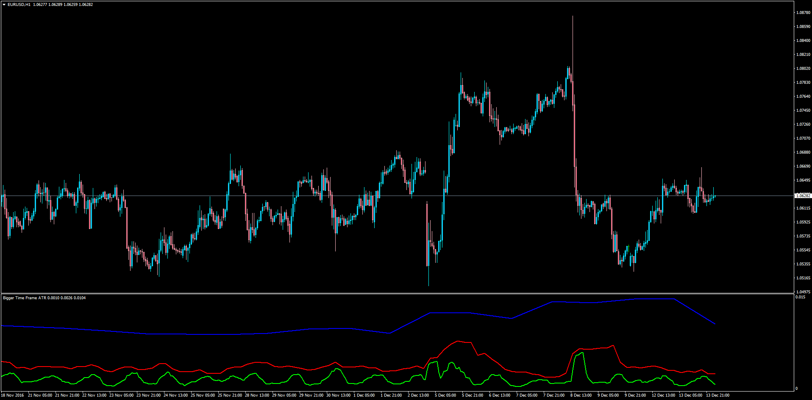

# Bigger Time Frame ATR

> Source: https://fxcodebase.com/code/viewtopic.php?f=38&t=64207  
> Forum: 38 · Topic 64207 · 1 post(s)

---

## Bigger Time Frame ATR

**Apprentice** · Wed Dec 14, 2016 7:49 am

LUA Original: [viewtopic.php?f=17&t=2634](https://fxcodebase.com/code/viewtopic.php?f=17&t=2634)

Description:

This oscillator will display either the current time frame ATR or the ATR of a choose higher time frame. The particularity of this work is that the trader can select up to 3 different time frames at the same time, making it an interesting tool to see how the values fluctuate according to the amplitud of the cycles.

 [BF_ATR.mq4](files/109930/BF_ATR.mq4)
