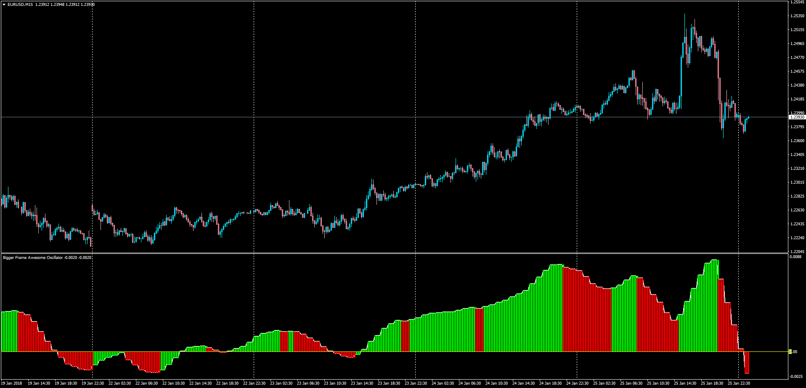

# Bigger Time Frame Awesome Oscillator

> Source: https://fxcodebase.com/code/viewtopic.php?f=38&t=65677  
> Forum: 38 · Topic 65677 · 1 post(s)

---

## Bigger Time Frame Awesome Oscillator

**Apprentice** · Fri Jan 26, 2018 9:34 am

LUA Original: [viewtopic.php?f=17&t=1593](https://fxcodebase.com/code/viewtopic.php?f=17&t=1593)

Description:

MT4 version of the LUA Original BF AO in which the awesome oscillator of a bigget time frame is displayed on the current chart. The green/red colors in the histogram represent the slope of the oscillator.

 [BF_AO.mq4](files/117279/BF_AO.mq4)
