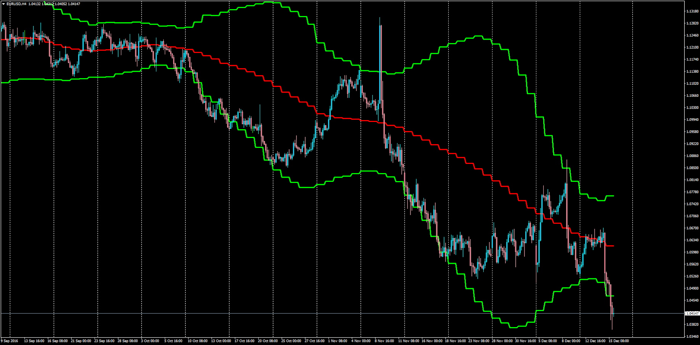

# Bigger Time Frame Bollinger Bands

> Source: https://fxcodebase.com/code/viewtopic.php?f=38&t=64216  
> Forum: 38 · Topic 64216 · 1 post(s)

---

## Bigger Time Frame Bollinger Bands

**Apprentice** · Fri Dec 16, 2016 4:00 am

LUA Original: [viewtopic.php?f=17&t=963](https://fxcodebase.com/code/viewtopic.php?f=17&t=963)

Description:

This indicator helps the trader select a bigger time frame bollinger bands to be visualized in a smaller TF.

Center Line is optional. The lines can be either Steps or Smoothed Bands depending on preference.

Optional Alert

A good thing about this Indicator is that the trader can also receive a sound or email or both notifications when price is above or below the upper or lower bollinger bands.

 [BTF_BBs.mq4](files/109950/BTF_BBs.mq4)
