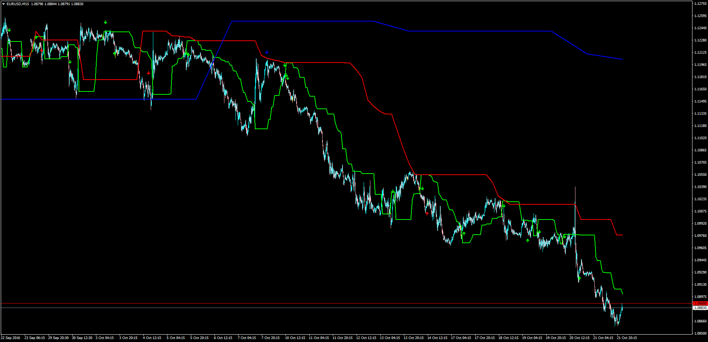

# Bigger TimeFrames Dynamic Trend

> Source: https://fxcodebase.com/code/viewtopic.php?f=38&t=64018  
> Forum: 38 · Topic 64018 · 1 post(s)

---

## Bigger TimeFrames Dynamic Trend

**Apprentice** · Sun Oct 23, 2016 3:16 pm

LUA Original: [viewtopic.php?f=17&t=2223](https://fxcodebase.com/code/viewtopic.php?f=17&t=2223)

Description:

This modification of the LUA original "Dynamic Trend" indicator will display the dynamic trend of 3 bigger time frames of the one that is being analyzed, up to 3 bigger time frames.

In the example the H1, H4 and Daily Dynamic Trends are visualized in the M15 chart, with arrows indicating when they change from up to down mode.

Also included is the MT4 version of the Dynamic Trend to display the Dynamic Trend of the current time frame.

 [Dynamic_Trend.mq4](files/108760/Dynamic_Trend.mq4)

 [Dynamic_Trend_MTF.mq4](files/108760/Dynamic_Trend_MTF.mq4)
