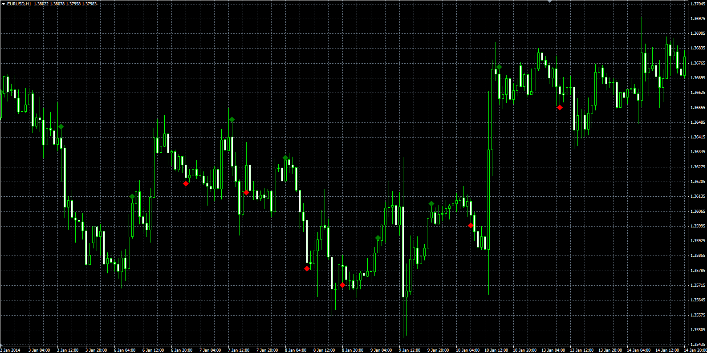

# Bill William's zone indicator

> Source: https://fxcodebase.com/code/viewtopic.php?f=38&t=60394  
> Forum: 38 · Topic 60394 · 1 post(s)

---

## Bill William's zone indicator

**Alexander.Gettinger** · Mon Mar 03, 2014 10:08 am

Original LUA indicator: [viewtopic.php?f=17&t=60393](https://fxcodebase.com/code/viewtopic.php?f=17&t=60393).

 

Download:

 [BW_Zone.mq4](files/92995/BW_Zone.mq4)

For this indicator must be installed Full Awesome oscillator ([viewtopic.php?f=38&t=60391](https://fxcodebase.com/code/viewtopic.php?f=38&t=60391)) and Full Accelerator oscillator ([viewtopic.php?f=38&t=60392](https://fxcodebase.com/code/viewtopic.php?f=38&t=60392)).
