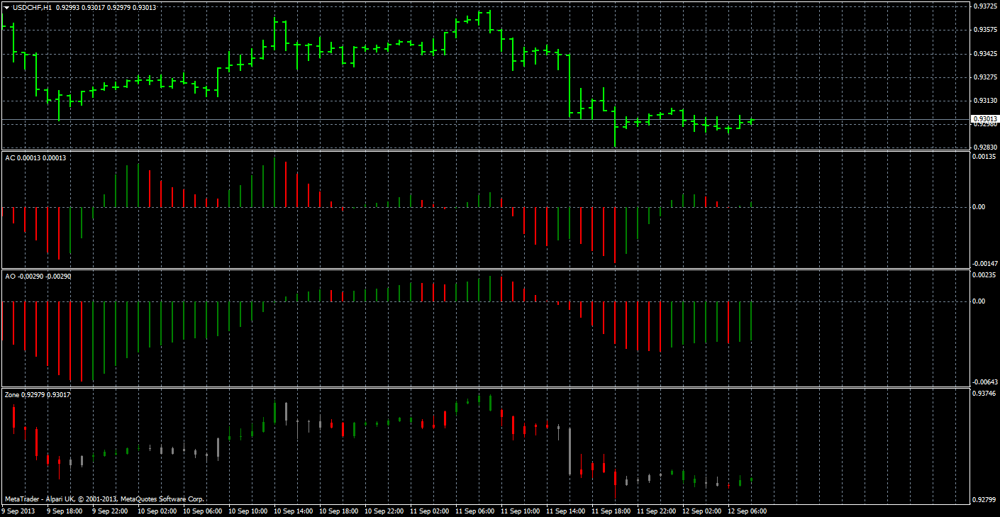

# Bill Williams Indicators

> Source: https://fxcodebase.com/code/viewtopic.php?f=38&t=59476  
> Forum: 38 · Topic 59476 · 1 post(s)

---

## Bill Williams Indicators

**Apprentice** · Thu Sep 12, 2013 12:45 am

Unlike preinstalled version,
Allows you to select desired moving average period,
and type of moving average.

Price_Mode
PRICE_CLOSE	0	Close price.
PRICE_OPEN	1	Open price.
PRICE_HIGH	2	High price.
PRICE_LOW	3	Low price.
PRICE_MEDIAN	4	Median price, (high+low)/2.
PRICE_TYPICAL	5	Typical price, (high+low+close)/3.
PRICE_WEIGHTED	6	Weighted close price, (high+low+close+close)/4.

MA_Mode
MODE_SMA	0	Simple moving average,
MODE_EMA	1	Exponential moving average,
MODE_SMMA	2	Smoothed moving average,
MODE_LWMA	3	Linear weighted moving average.

 [AO.mq4](files/89396/AO.mq4)

 [AC.mq4](files/89396/AC.mq4)

 [Zone Trading.mq4](files/89396/Zone%20Trading.mq4)
