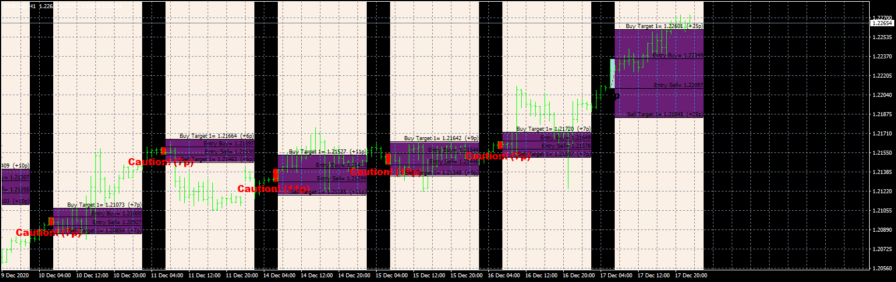

# Billions$

> Source: https://fxcodebase.com/code/viewtopic.php?f=38&t=71176  
> Forum: 38 · Topic 71176 · 3 post(s)

---

## Billions$

**Apprentice** · Fri May 07, 2021 4:27 am

Based on the request.
[https://fxcodebase.com/code/viewtopic.php?f=27&t=70893](https://fxcodebase.com/code/viewtopic.php?f=27&t=70893)

 [Billions$.mq4](files/141930/Billions.mq4)

---

## Re: Billions$

**FRANKSUPANAT** · Thu Sep 02, 2021 10:01 am

> **Apprentice wrote:**
>
>
> eurusd-h1-fxcm-australia-pty-3.png
>
>
> Based on the request.
> [https://fxcodebase.com/code/viewtopic.php?f=27&t=70893](https://fxcodebase.com/code/viewtopic.php?f=27&t=70893)
>
>
> Billions$.mq4

Can you delete martingale system?
Can you make this EA to Recovery Zone trading and trailing sl?
Rule,set level of tp 5 targets.
set buy stop at entry buy line and sell stop at entry sell line.
It has two cases, 1.correct way and 2.wrong way.
if correct way, trailing sl to target1 if price touch target2.
trailing sl to target2 if price touch target3.
trailing sl to target3 if price touch target4.
trailing sl to target4 if price touch target5. like this.
if price touch trailing stop at some level target , close all.

if wrong way, such as first lot is 0.1lot
price touch at buy entry but price down to sell entry.
sell o.2 lot at sell entry and let it trailing sl like case in correct way.
but if it wrong again price up to touch buy entry before touch target2.
buy it at 0.3 lot. and loop same recovery zone system.
0.1 > 0.3 > 1.2
0.2 > 0.6 > and can you let users set change lot size by themselves.
thanks you .

---

## Re: Billions$

**Apprentice** · Fri Sep 03, 2021 5:31 am

Your request is added to the development list.
Development reference 799.
