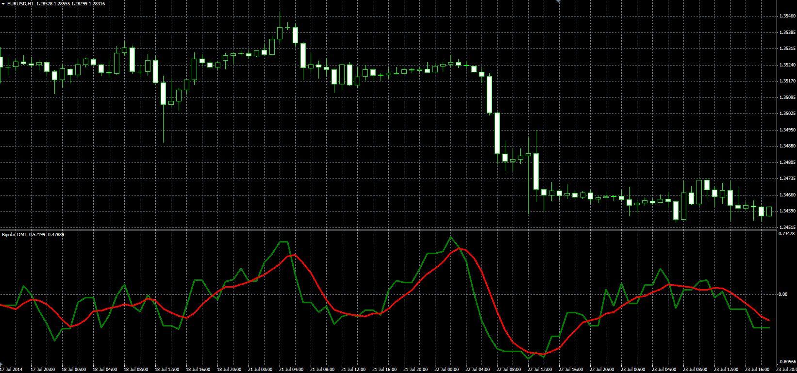

# Bipolar DMI (DMX)

> Source: https://fxcodebase.com/code/viewtopic.php?f=38&t=61233  
> Forum: 38 · Topic 61233 · 1 post(s)

---

## Bipolar DMI (DMX)

**Alexander.Gettinger** · Tue Sep 23, 2014 10:38 am

Original LUA oscillator: [viewtopic.php?f=17&t=27832](https://fxcodebase.com/code/viewtopic.php?f=17&t=27832).

Formulas:
DMX = (P-M)/(P+M),
Signal = MA(DMX) with [Smoothing_Length] number of periods and [Smoothing_Method] type, where
P - (+DI) mode of ADX indicator,
M - (-DI) mode of ADX indicator.

 

Download:

 [DMX.mq4](files/96130/DMX.mq4)
