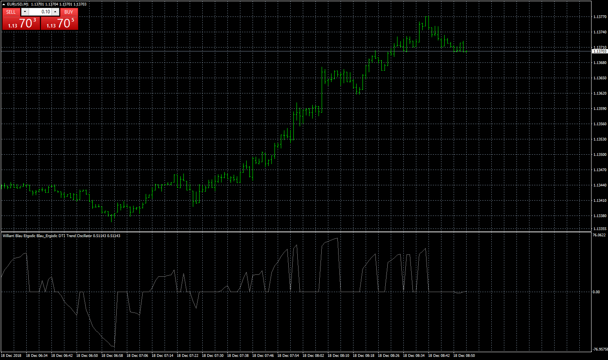
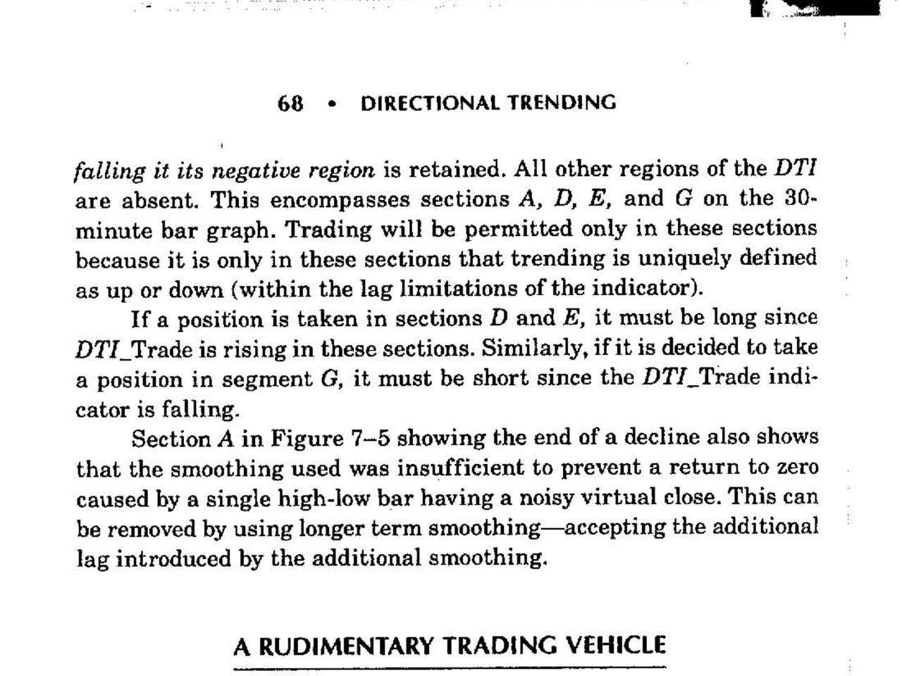

# Blau_Ergodic_DTI_Trend

> Source: https://fxcodebase.com/code/viewtopic.php?f=38&t=67176  
> Forum: 38 · Topic 67176 · 4 post(s)

---

## Blau_Ergodic_DTI_Trend

**Apprentice** · Tue Dec 18, 2018 5:51 am

 

 [Blau_Ergodic_DTI_Trend.mq4](files/122910/Blau_Ergodic_DTI_Trend.mq4)

---

## Re: Blau_Ergodic_DTI_Trend

**logicgate** · Tue Dec 18, 2018 7:31 am

That is exactly it, awesome!!

My friend, did you add MTF option to it? Like I said, I think this would be more useful if we could, for instance, if we loaded the indi into a 15min timeframe, and choose in the indi options for it to plot the DTI_Trend of 1 hour timeframe.

---

## Re: Blau_Ergodic_DTI_Trend

**Apprentice** · Tue Dec 18, 2018 8:42 am

Your request is added to the development list under Id Number 4376

---

## Re: Blau_Ergodic_DTI_Trend

**Apprentice** · Fri Dec 28, 2018 6:29 am

Try it now.
