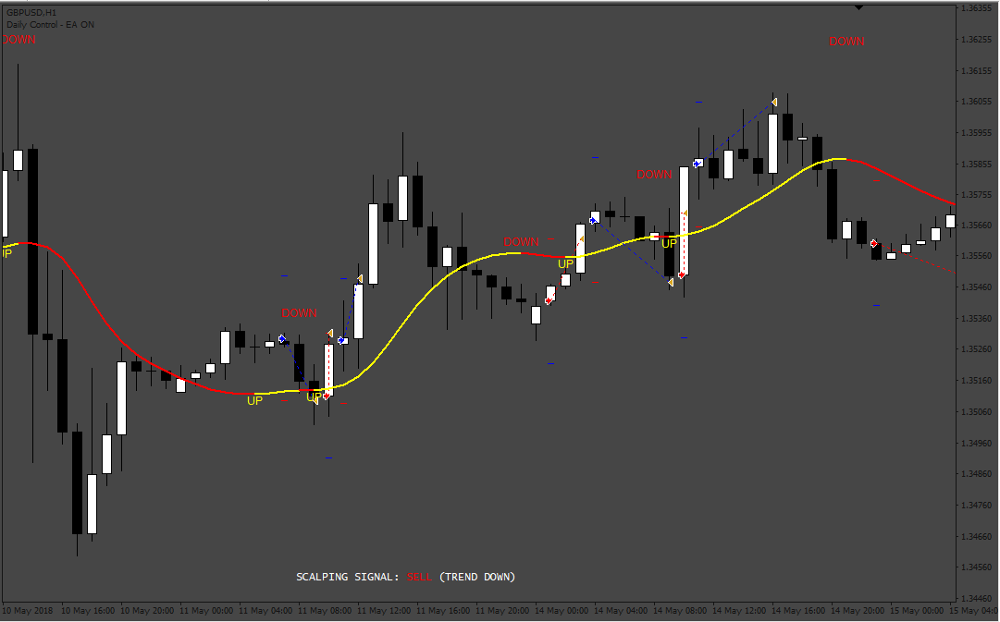

# BMC 100 PIPS EA

> Source: https://fxcodebase.com/code/viewtopic.php?f=38&t=72804  
> Forum: 38 · Topic 72804 · 16 post(s)

---

## BMC 100 PIPS EA

**Apprentice** · Wed Oct 05, 2022 4:14 am

Based on the request.
[https://fxcodebase.com/code/viewtopic.php?f=27&t=72772](https://fxcodebase.com/code/viewtopic.php?f=27&t=72772)

 [BMC 100 PIPS.mq4](files/147746/BMC%20100%20PIPS.mq4)

 [BMC 100 PIPS EA.mq4](files/147746/BMC%20100%20PIPS%20EA.mq4)

---

## Re: BMC 100 PIPS EA

**Asdac1** · Wed Oct 05, 2022 5:56 am

> **Apprentice wrote:**
>
>
> 601pic.png
>
>
> Based on the request.
> [https://fxcodebase.com/code/viewtopic.php?f=27&t=72772](https://fxcodebase.com/code/viewtopic.php?f=27&t=72772)
>
>
> BMC 100 PIPS.mq4
>
>
>
>
> BMC 100 PIPS EA.mq4

Thanks Apprentice, will run it and get back to you with observations.

---

## Re: BMC 100 PIPS EA

**Asdac1** · Thu Oct 06, 2022 12:00 am

BMC 100 Pips ignoring signals. It worked for a while as it should then stopped.
How it should go is: Buy signal closes Sell signal closes Buy signal closes Sell signal (unending loop)

---

## Re: BMC 100 PIPS EA

**Asdac1** · Thu Oct 06, 2022 12:02 am

Expert Log file attached

---

## Re: BMC 100 PIPS EA

**Apprentice** · Fri Oct 07, 2022 2:01 pm

Please use this setup in the updated version
- Max Trades at same time = 1
- Take Profit = Off
- Stop Loss = Off
- Close All in opposite signal = true

---

## Re: BMC 100 PIPS EA

**Asdac1** · Mon Oct 10, 2022 12:28 am

Pleas which is the updated version of the EA? Can't locate it.

---

## Re: BMC 100 PIPS EA

**Apprentice** · Tue Oct 11, 2022 3:11 am

Same version with these different parameters.

---

## Re: BMC 100 PIPS EA

**Asdac1** · Tue Oct 11, 2022 7:19 am

ok thanks, testing already

---

## Re: BMC 100 PIPS EA

**Asdac1** · Fri Oct 14, 2022 9:48 am

> **Apprentice wrote:**
> Please use this setup in the updated version
> - Max Trades at same time = 1
> - Take Profit = Off
> - Stop Loss = Off
> - Close All in opposite signal = true

Hi Apprentice, happy weekend ahead to you and your crew. I have tested the EA this whole week with mixed reactions. Its a good Indicator EA and it keeps banging in the pips (120 - 180/day) according to my strategy until it misses a new alert and 1 or 2 missed alerts / trend change missed results in all profits wiped out. I have attached an image of my settings to confirm am following your instructions.

---

## Re: BMC 100 PIPS EA

**Apprentice** · Tue Oct 18, 2022 2:07 am

The parameter are ok.

---

## Re: BMC 100 PIPS EA

**Asdac1** · Mon Oct 24, 2022 2:18 am

Hi Apprentice, ive tested the BMC 100 Pips EA and have only one error to piont out, it skips signals which leads to costly losses after a long string on wins based on my strategy.

 

*TRades Ignored*

---

## Re: BMC 100 PIPS EA

**Asdac1** · Mon Oct 24, 2022 2:32 am

By my testing, the EA is works but could be way better in its performance. The indicator BMC 100 PIPS gives buy and sell signals based on the trendline directional change. I would be so so grateful if the EA could be programed as an option to either follow the onscreen trendline signals or the signal alerts it generates. i.e:

OPTIONS:

1. Trendline Autotrading

 

*Trendline autotrading*

2. Buy / Sell signal Autotrading

 

*Buy Sell Signals.*

Thanks, am very much expectant

---

## Re: BMC 100 PIPS EA

**Apprentice** · Tue Nov 08, 2022 9:32 am

Updated

---

## Re: BMC 100 PIPS EA

**nhzglobal** · Tue Jan 31, 2023 8:33 pm

Cant Run this it gives the following error, Can you please guide how to run this EA, Thanks in Advance

2023.02.01 01:32:26.724	2022.11.01 00:09:00 cannot open file 'C:\Users\HA\AppData\Roaming\MetaQuotes\Terminal\64DE3E3C6A713CE8B82A3973FFFBEB30\MQL4\indicators\5TF Waddah Attar Explosion.ex4' [2]

---

## Re: BMC 100 PIPS EA

**Apprentice** · Wed Feb 01, 2023 3:54 am

We have added your request to the development list.
Development reference 109.

---

## Re: BMC 100 PIPS EA

**Apprentice** · Wed Feb 15, 2023 3:24 am

[BMC_100_PIPS.ex4](files/149626/BMC_100_PIPS.ex4)

 [5TF_Waddah_Attar_Explosion.ex4](files/149626/5TF_Waddah_Attar_Explosion.ex4)
