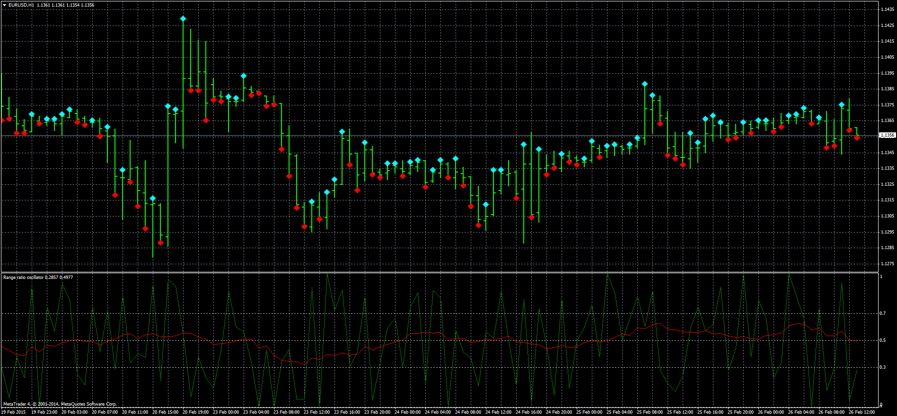

# Body to Candle Ratio

> Source: https://fxcodebase.com/code/viewtopic.php?f=38&t=61873  
> Forum: 38 · Topic 61873 · 1 post(s)

---

## Body to Candle Ratio

**Apprentice** · Thu Feb 26, 2015 6:14 am

Range = (Close-Low)/(High-Low)

 [Body to Candle Ratio.mq4](files/98854/Body%20to%20Candle%20Ratio.mq4)

 [Body to Candle Ratio Indicator.mq4](files/98854/Body%20to%20Candle%20Ratio%20Indicator.mq4)

Mode 0
Up - Range > 0.5
Down - Range < 0.5
Mode 1
Up - Range > MA of Range
Down - Range < MA of Range
