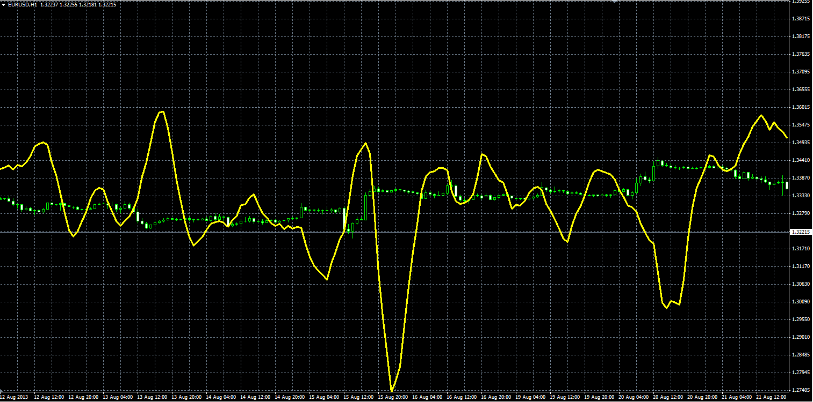
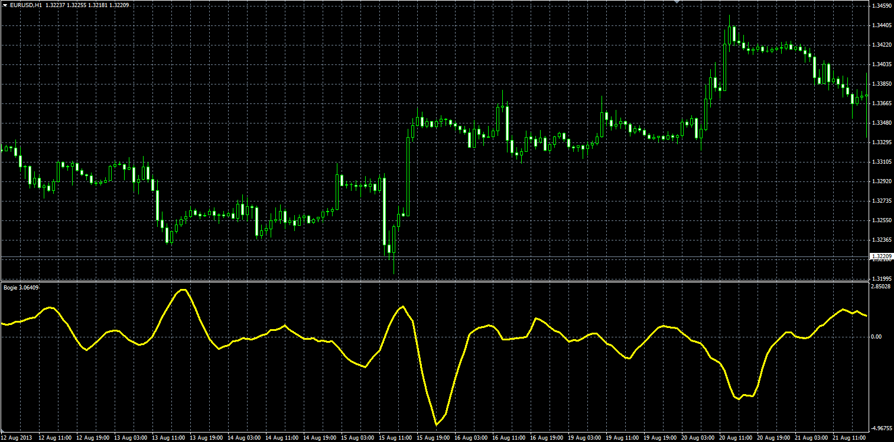

# Bogie

> Source: https://fxcodebase.com/code/viewtopic.php?f=38&t=59354  
> Forum: 38 · Topic 59354 · 1 post(s)

---

## Bogie

**Alexander.Gettinger** · Thu Aug 29, 2013 11:16 am

Original LUA indicator: [http://fxcodebase.com/code/viewtopic.php?f=17&t=54668](https://fxcodebase.com/code/viewtopic.php?f=17&t=54668).

Formulas:
Bogie = (L-R)/(Short_Length-Long_Length), where
L[i] = Simple Moving average(Short_Length-1, i-1)*(Short_Length-1)*Long_Length,
R[i] = Simple Moving average(Long_Length-1, i-1)*(Long_Length-1)*Short_Length.

Indicator:

 

Download:

 [Bogie_I.mq4](files/89020/Bogie_I.mq4)

Oscillator:

 

Download:

 [Bogie_O.mq4](files/89020/Bogie_O.mq4)
