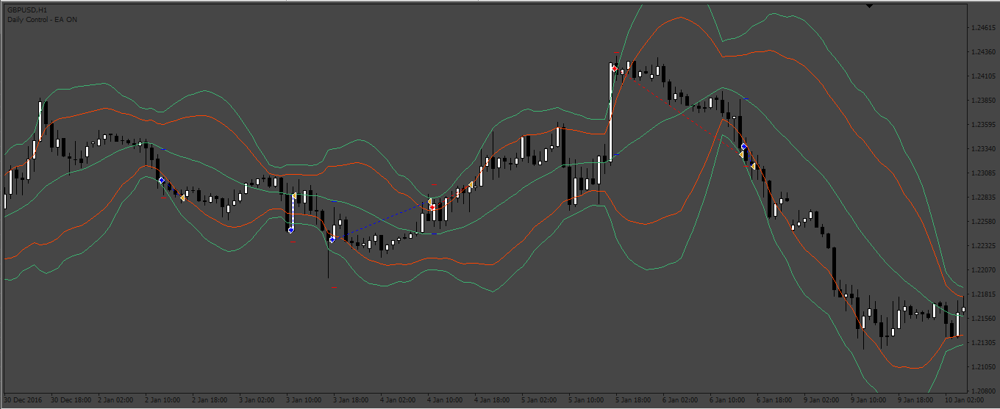
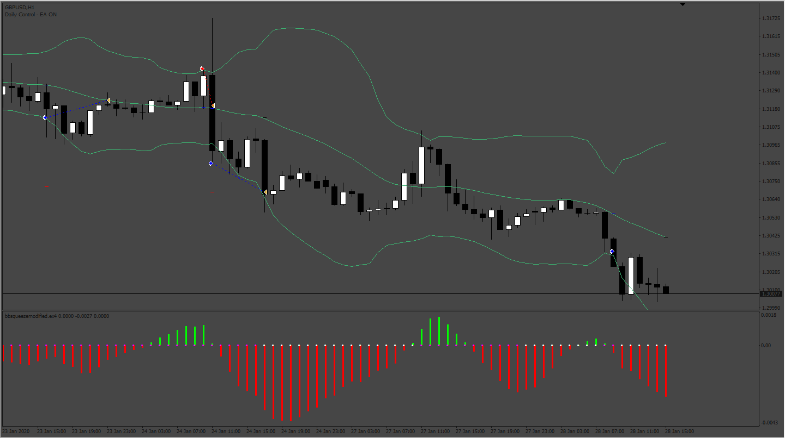

# Bollinger_Band_20-3_crossing

> Source: https://fxcodebase.com/code/viewtopic.php?f=38&t=73310  
> Forum: 38 · Topic 73310 · 10 post(s)

---

## Bollinger_Band_20-3_crossing

**Apprentice** · Wed Feb 01, 2023 11:01 am

Based on the request.
[https://fxcodebase.com/code/viewtopic.php?f=27&p=149320](https://fxcodebase.com/code/viewtopic.php?f=27&p=149320)

 [Bollinger_Band_20-3_crossing.mq4](files/149425/Bollinger_Band_20-3_crossing.mq4)

 [bbsqueezemodified.mq4](files/149425/bbsqueezemodified.mq4)

---

## Re: Bollinger_Band_20-3_crossing

**LuckyLucos** · Thu Feb 02, 2023 6:44 am

Hello Apprentice,
I want to make some clarifications about this EA because it does not behave satisfactorily.
Attached is a screenshot to clarify my comments.

Rule #1: Sell or buy entries are only taken when price is in the squeeze zone. This area is indicated by the indicator with the small pink circles. Outside of this area, no entry should be taken.
In the EA settings, the squeeze indicator settings should be able to be adjusted.

Rule #2: In the case of a buy like here on X1 and X2, the entry must be programmed on the low of the candle and not on the close. I imagine that it must be difficult to code but we could consider that as here in the case of a unit of time in 2 mn, at 1mn 50s, we take the bottom as a reference at this precise instant.

In the case of a sale, it is the opposite, we take the high of the candle as an entry.

Rule #3: The stop lost must be configurable. I said 5 pips in my previous post, but that's not enough. On X1, we see that the low of the next candle exceeds the low of X1, hence the need to properly adjust the stop loss.

Rule #4: Take profit must be taken as soon as price breaks MA20 (yellow arrow). If it does not reach MA20, as here with X3, a trailing stop can be set as well as a break even.

Thanks for your comments.

---

## Re: Bollinger_Band_20-3_crossing

**Apprentice** · Sun Feb 05, 2023 4:39 am

We have added your request to the development list.
Development reference 131.

---

## Re: Bollinger_Band_20-3_crossing

**LuckyLucos** · Sat Feb 18, 2023 10:26 am

Hi Apprentice.
Is there any update fot this project?
Thanks
LuckyLucos

---

## Re: Bollinger_Band_20-3_crossing

**Apprentice** · Tue Feb 28, 2023 5:05 am

Can you please provide the squeeze indicator used?

---

## Re: Bollinger_Band_20-3_crossing

**LuckyLucos** · Tue Feb 28, 2023 10:18 am

Hello Apprentice

Attached the squeeze indicator I use.
Thank You.

 [bbsqueezemodified.mq4](files/149823/bbsqueezemodified.mq4)

 [bbsqueezemodified.ex4](files/149823/bbsqueezemodified.ex4)

---

## Re: Bollinger_Band_20-3_crossing

**Apprentice** · Sun Mar 05, 2023 6:46 pm

Try it now.

---

## Re: Bollinger_Band_20-3_crossing

**LuckyLucos** · Sun Mar 05, 2023 8:38 pm

Hello Apprentice;
The modifications made with the BB squeeze modified indicator bring an improvement in the entries except that they are rarely in the right direction.
I also do not understand the usefulness of the Band2 parameters. What is it used for?
The set up is however simple;
When we are in the squeeze zone set by the BBsqueezemodified indicator:
We sell as soon as the price crosses the upper Bollinger band.
We close as soon as the price crosses the central band downwards.
We buy as soon as the price crosses the lower Bollinger band.
We close as soon as the price crosses the central band upwards.

Thank you.

---

## Re: Bollinger_Band_20-3_crossing

**Apprentice** · Sat Mar 11, 2023 4:49 am

We have added your request to the development list.
Development reference 241.

---

## Re: Bollinger_Band_20-3_crossing

**Apprentice** · Sat Mar 18, 2023 2:17 am

 [bbsqueezemodified.mq4](files/150030/bbsqueezemodified.mq4)

 [Bollinger_Band_20-3_crossing_v3.mq4](files/150030/Bollinger_Band_20-3_crossing_v3.mq4)
