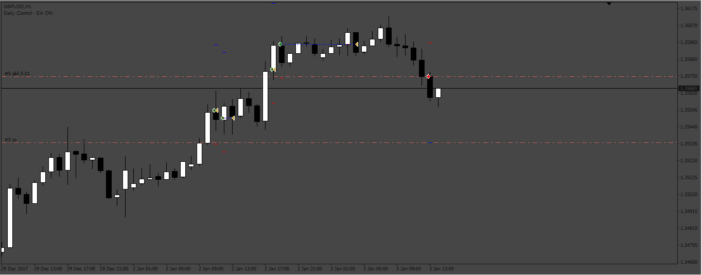
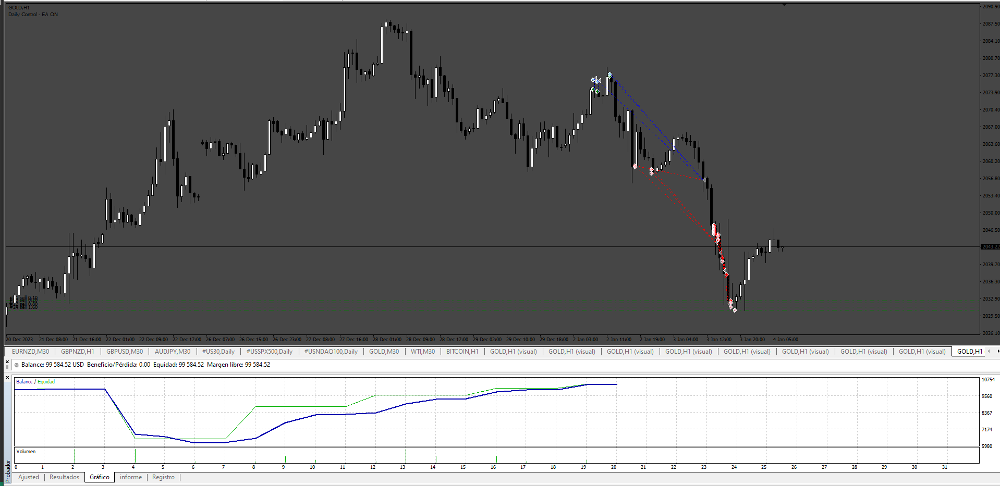

# Bollinger_Band_EA

> Source: https://fxcodebase.com/code/viewtopic.php?f=38&t=73458  
> Forum: 38 · Topic 73458 · 4 post(s)

---

## Bollinger_Band_EA

**Apprentice** · Sun Mar 05, 2023 6:36 pm

Based on the request.
[https://fxcodebase.com/code/viewtopic.php?f=38&p=149760](https://fxcodebase.com/code/viewtopic.php?f=38&p=149760)

 [Bollinger_Band_EA.mq4](files/149881/Bollinger_Band_EA.mq4)

---

## Re: Bollinger_Band_EA

**[email protected]** · Mon Aug 04, 2025 4:21 am

> **Apprentice wrote:**
>
>
> 187pic.png
>
>
> Based on the request.
> [https://fxcodebase.com/code/viewtopic.php?f=38&p=149760](https://fxcodebase.com/code/viewtopic.php?f=38&p=149760)
>
>
> Bollinger_Band_EA.mq4

Hi. Please add Spread filter and Grid option to this EA

Grid with these Options:

Grid Setup:
Grid: (On/Off)
Grid mode (Stop) , Stop : only open positions when first position gain profit . for buy signal only buy grid and for sell signal only sell grid.
Lot mode (Multiplier/ Addition)
Grid mode (Stop) , Stop : open positions when first position (signal) gain profit
Grid Max Count by user : (Number)
Grid Max Lot by user : (Lot)
Grid Multiplier by user : (Factor)
Grid Addition Lot by user : (Lot)
Grid Distance by user : (Pip)
Close Grid: (True/False)
Close grid TP: (Pips)
Close grid SL: (Pips)
Close grid in opposite signal: (True/False)

Also please change
Daily Time Limit: (GMT/Local/Server) (Start Hour/End Hour)
Mandatory closing all position for non trading time: (True/False)

Thanks in Advance.

---

## Re: Bollinger_Band_EA

**Apprentice** · Mon Aug 04, 2025 4:28 am

We have added your request to the development list.
Development reference 492

---

## Re: Bollinger_Band_EA

**Apprentice** · Sun Aug 10, 2025 4:37 am

 [Bollinger_Band_EA.mq4](files/160183/Bollinger_Band_EA.mq4)
