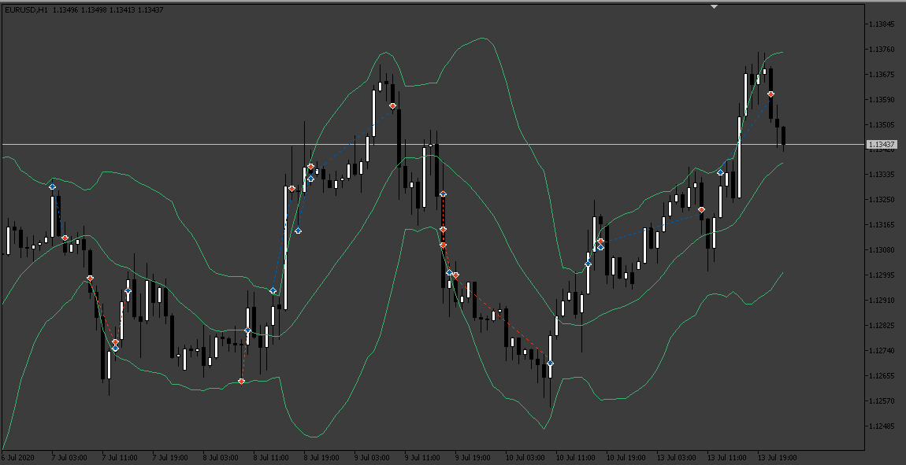

# Bollinger Band EA

> Source: https://fxcodebase.com/code/viewtopic.php?f=38&t=72735  
> Forum: 38 · Topic 72735 · 16 post(s)

---

## Bollinger Band EA

**Apprentice** · Wed Sep 21, 2022 1:48 am

Based on the request.
[https://fxcodebase.com/code/viewtopic.php?f=38&t=72691](https://fxcodebase.com/code/viewtopic.php?f=38&t=72691)

 [Bollinger Band EA.mq5](files/147516/Bollinger%20Band%20EA.mq5)

 [Bollinger_Band_EA.mq4](files/147516/Bollinger_Band_EA.mq4)

---

## Re: Bollinger Band EA

**Sp2562** · Mon Sep 26, 2022 12:55 pm

yes its functioning is perfect, we just need to correct the stop

when opening the order the stop must be positioned at 20 pips when the candle goes up 40 pips the stop goes up 20 pips (always with a difference of 20 pips) if the candle retraces 20 pips stop trade

and add date and time for the robot to turn on/off, this robot will trade scheduled news when the candle explodes the stop always goes along with 20pips when it retracts the stop trade

---

## Re: Bollinger Band EA

**Apprentice** · Wed Sep 28, 2022 11:12 am

We have added your request to the development list.
Development reference 597.

---

## Re: Bollinger Band EA

**Sp2562** · Fri Jan 13, 2023 3:44 pm

Please can you do it in MT4 version as well.

Thanks. We are going to start some tests here and for sure we are going to help the $$$$ community that always supported us and helped us in moments. Without you, we certainly would not have done our projects.

Thank you, always.

---

## Re: Bollinger Band EA

**Apprentice** · Sun Jan 15, 2023 4:43 am

We have added your request to the development list.
Development reference 43.

---

## Re: Bollinger Band EA

**Apprentice** · Tue Jan 17, 2023 7:46 am

Bollinger_Band_EA.mq4 added.

---

## Re: Bollinger Band EA

**vishal12** · Tue Jan 17, 2023 10:33 am

> **Apprentice wrote:**
> Bollinger_Band_EA.mq4 added.

Hi sir EA Giving error to attach below
2023.01.17 07:32:11.208	cannot open file AppData\Roaming\MetaQuotes\Terminal\0C2BFA140CA8FBEFEDCADDDEDD61AA24\MQL4\indicators\Code_Bars.ex4' [2]
Please do needful

---

## Re: Bollinger Band EA

**Sp2562** · Wed Jan 18, 2023 7:43 pm

Hello, first I would like to thank you for the development. Congratulations turned out great.

But it's giving an error number 134. I'm testing it on the DEMO account and I'm going to do this for a while.

Could you do some analysis?

The settings are marked according to the attached image.

In the real trading field, check the option to allow real trading. If this field had not been marked the EA would not work.

---

## Re: Bollinger Band EA

**Apprentice** · Fri Jan 20, 2023 11:34 am

We have added your request to the development list.
Development reference 53.

---

## Re: Bollinger Band EA

**Sp2562** · Tue Jan 24, 2023 9:40 pm

Sorry for the previous message, the EA is working. There was an error with the lot and leverage calculation here. Forgive me, it's all right.

---

## Re: Bollinger Band EA

**Apprentice** · Thu Feb 16, 2023 3:33 pm

597 resolved.

---

## Re: Bollinger Band EA

**nhzglobal** · Thu Feb 16, 2023 6:06 pm

Hello Can anyone tell me settings for this? I am not getting good results for this during testing. thanks in advance.

---

## Re: Bollinger Band EA

**Weiss SC** · Sat Feb 25, 2023 12:04 am

Hello! breakeven in sell position no working. Tell me what could be the problem? if the block breakeven I checked many times and did not understand... Thanks!

---

## Re: Bollinger Band EA

**Apprentice** · Tue Feb 28, 2023 4:08 am

MT4 or MT5?

We have added your request to the development list.
Development reference 187.

---

## Re: Bollinger Band EA

**Weiss SC** · Thu Mar 02, 2023 11:01 pm

> **Apprentice wrote:**
> MT4 or MT5?
>
> We have added your request to the development list.
> Development reference 187.

 Thanks! MT4

---

## Re: Bollinger Band EA

**Apprentice** · Sun Mar 05, 2023 6:37 pm

Try this version.
[https://fxcodebase.com/code/viewtopic.php?f=38&t=73458](https://fxcodebase.com/code/viewtopic.php?f=38&t=73458)
