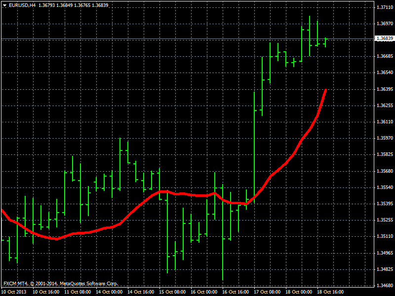
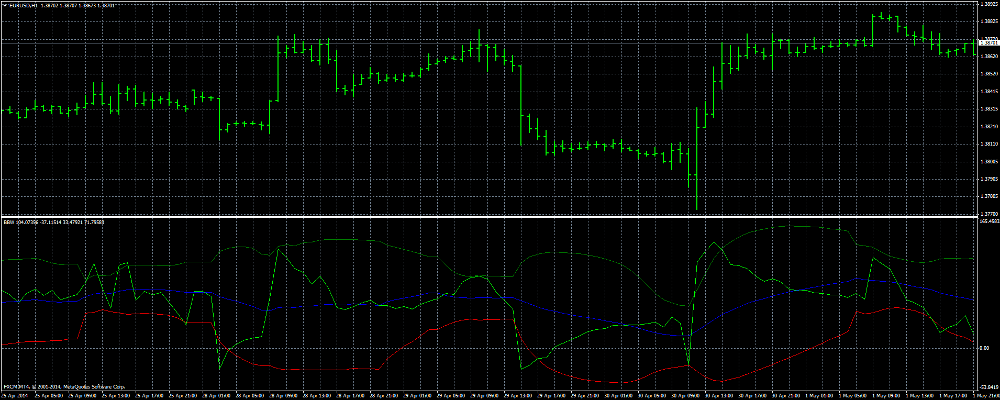

# Bollinger Band Percentage Oscillator Averege

> Source: https://fxcodebase.com/code/viewtopic.php?f=38&t=60631  
> Forum: 38 · Topic 60631 · 3 post(s)

---

## Bollinger Band Percentage Oscillator Averege

**Apprentice** · Sat May 03, 2014 11:58 am

Posted by request.
[viewtopic.php?f=17&t=1373](https://fxcodebase.com/code/viewtopic.php?f=17&t=1373)

Derived from the normalized, averaged value of price within the channel, defined by Standard Deviations. Bollinger Band Oscillator Percentage Averege and Price Action have limited correlation. Price level, around Which Price oscillates, will be shown by BBOPA.

 [BBPOMVA.ex4](files/93808/BBPOMVA.ex4)

---

## Bollinger Band Waves

**Apprentice** · Sun May 04, 2014 4:46 am

BBW have two, Overbought levels 100 and upper belt line
and two, Oversold, levels 0 and the lower belt line.

Signals are generated when BBW cross the center line.

Strong signals of opposite directions are generated in or near Oversold, Overbought areas.
Weak signals of same directions are generated in or near Oversold, Overbought areas.

Buy signals while the central line is falling are questionable, and vice versa, They should be ignored.

 [BBW.mq4](files/93821/BBW.mq4)

---

## Re: Bollinger Band Percentage Oscillator Averege

**pakoromeu** · Sun May 04, 2014 2:05 pm

Downloaded. Thanks
