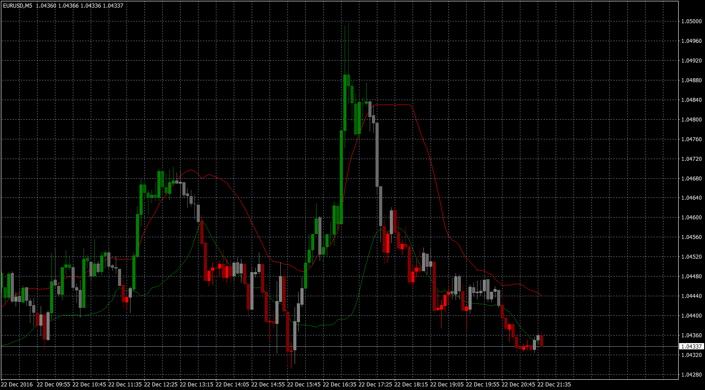

# Bollinger Band

> Source: https://fxcodebase.com/code/viewtopic.php?f=38&t=64300  
> Forum: 38 · Topic 64300 · 1 post(s)

---

## Bollinger Band

**Apprentice** · Sun Jan 15, 2017 5:01 am

Based on Lua.
[viewtopic.php?f=17&t=63078&p=104467&hilit=Bollinger+Bands+.lua#p104467](https://fxcodebase.com/code/viewtopic.php?f=17&t=63078&p=104467&hilit=Bollinger+Bands+.lua#p104467)

 [Bollinger Band.mq4](files/110520/Bollinger%20Band.mq4)
