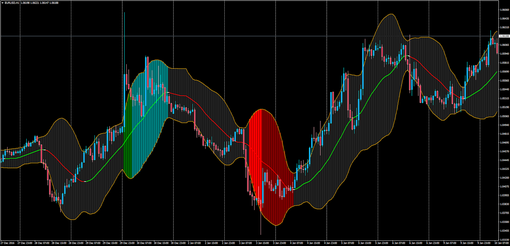

# Bollinger Bands Analyzer

> Source: https://fxcodebase.com/code/viewtopic.php?f=38&t=64453  
> Forum: 38 · Topic 64453 · 1 post(s)

---

## Bollinger Bands Analyzer

**Apprentice** · Tue Feb 14, 2017 2:50 am

This is a complete study of the Marketscope Bollinger Bands Analyzer which has been now completly ported to MT4.

It first smoothen the bands using any of 17 different averaging methods and then analyzes the up and down bubble, sausage or squeeze stages.

 [BB_Analyzer_2.mq4](files/111061/BB_Analyzer_2.mq4)

TS2/Lua version.
[viewtopic.php?f=17&t=23335](https://fxcodebase.com/code/viewtopic.php?f=17&t=23335)
