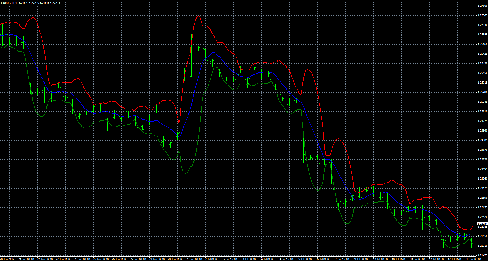
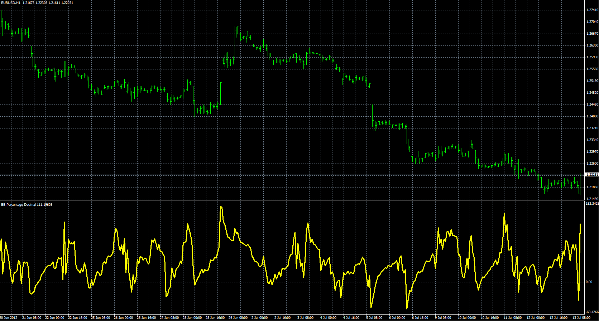
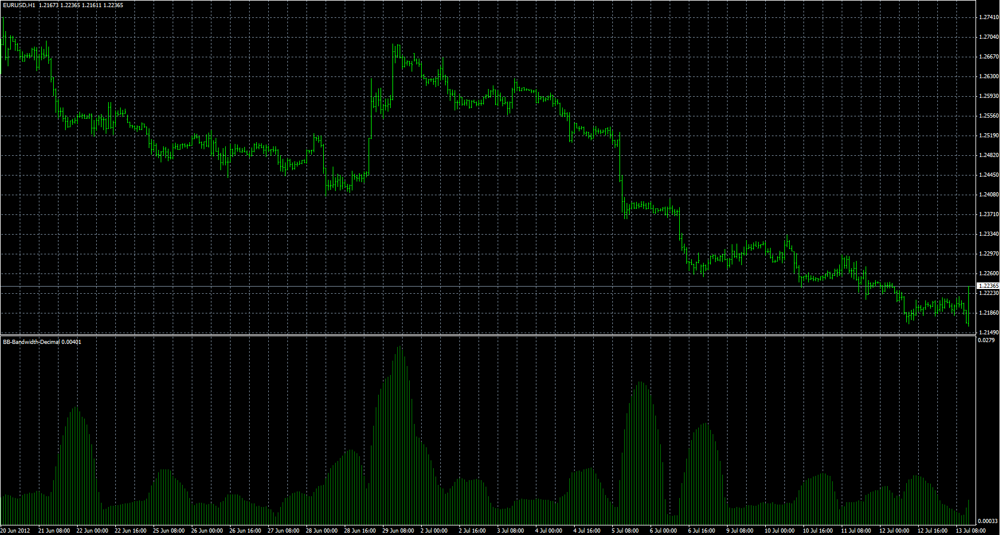
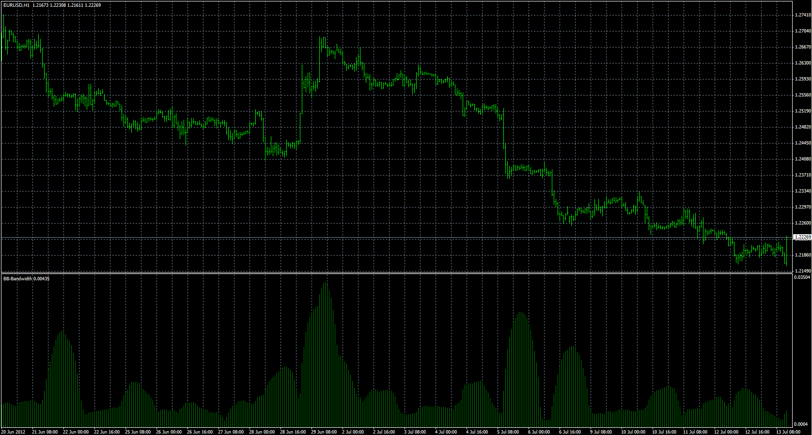

# Bollinger Bands Decimal - Original, Percentage, Bandwidth

> Source: https://fxcodebase.com/code/viewtopic.php?f=38&t=21029  
> Forum: 38 · Topic 21029 · 2 post(s)

---

## Bollinger Bands Decimal - Original, Percentage, Bandwidth

**Alexander.Gettinger** · Fri Jul 13, 2012 8:42 am

Original indicators: [viewtopic.php?f=17&t=237](https://fxcodebase.com/code/viewtopic.php?f=17&t=237)

Bollinger Bands Decimal.

 

Download:

 [BB-Decimal.mq4](files/36854/BB-Decimal.mq4)

Bollinger Bands Percentage Decimal.

 

Download:

 [BB-Percentage-Decimal.mq4](files/36854/BB-Percentage-Decimal.mq4)

---

## Re: Bollinger Bands Decimal - Original, Percentage, Bandwidth

**Alexander.Gettinger** · Fri Jul 13, 2012 8:45 am

Bollinger Bands Percentage Decimal.

> BAND = ((TL - BL) / CL);

 

Download:

 [BB-Bandwidth-Decimal.mq4](files/36855/BB-Bandwidth-Decimal.mq4)

Bollinger Bands Bandwidth with Simple Bollinger Bands Bandwidth option

> BAND = (TL - BL)

 

Download:

 [BB-Bandwidth.mq4](files/36855/BB-Bandwidth.mq4)
