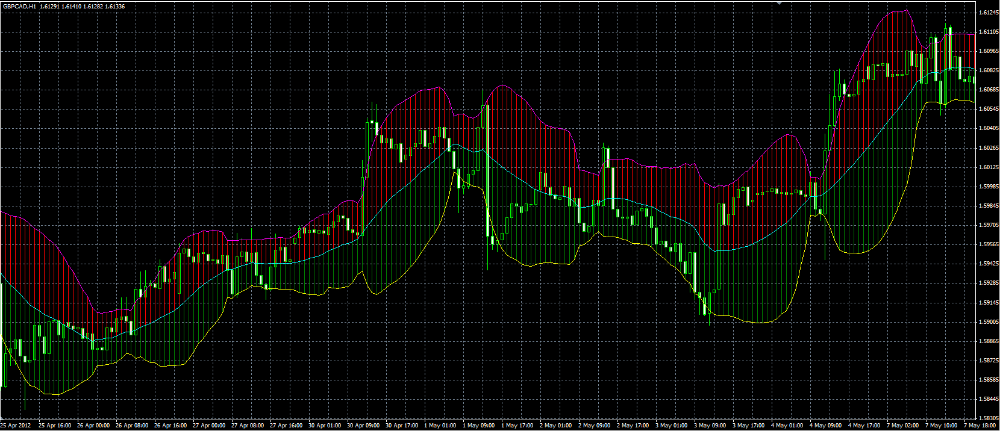

# Bollinger bands with color zones

> Source: https://fxcodebase.com/code/viewtopic.php?f=38&t=17985  
> Forum: 38 · Topic 17985 · 4 post(s)

---

## Bollinger bands with color zones

**Alexander.Gettinger** · Tue May 08, 2012 5:17 pm

Original indicator: [viewtopic.php?f=17&t=12838&p=25181](https://fxcodebase.com/code/viewtopic.php?f=17&t=12838&p=25181)

 

Download:

 [BB_Cloud.mq4](files/32540/BB_Cloud.mq4)

---

## Re: Bollinger bands with color zones

**Trinbago22** · Mon Sep 09, 2013 3:21 pm

This is not the MT4 BB am looking for this one has vertical lines and not real clouds. The shift feature should be in the indicator settings, if you look at the mt4 BB it contain, period-deviation-shift, yours only contain period-deviation, you left out the shift part. Shift means displacement to the right or left of price which is very important if you understand standard deviation. I only trade when price goes outside the Bands, if band is not shifted, price will only ride the band which is not a trading method to me. Can you fix it?? Thank you.

---

## Re: Bollinger bands with color zones

**Apprentice** · Tue Sep 10, 2013 1:41 am

Your request is added to the development list.

---

## Re: Bollinger bands with color zones

**Apprentice** · Sat Feb 11, 2017 3:31 am

Indicator was revised and updated.
