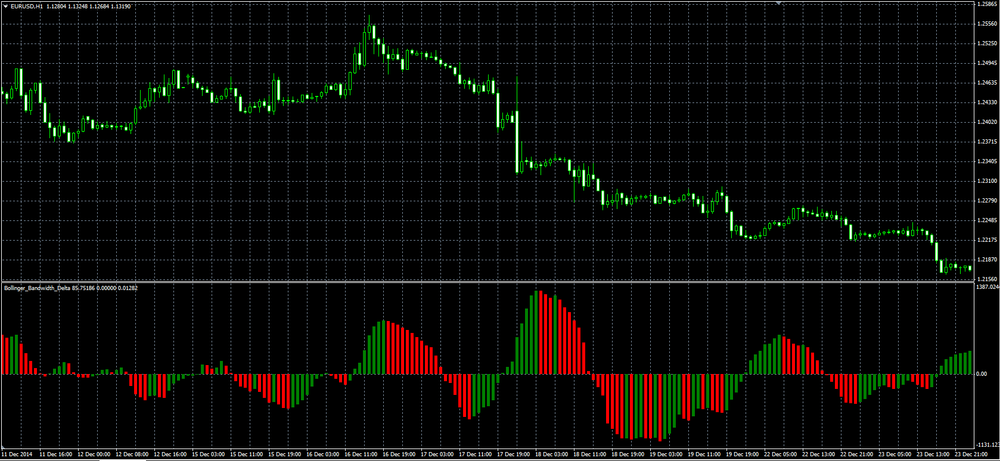

# Bollinger Bandwith Delta

> Source: https://fxcodebase.com/code/viewtopic.php?f=38&t=62247  
> Forum: 38 · Topic 62247 · 1 post(s)

---

## Bollinger Bandwith Delta

**Alexander.Gettinger** · Fri May 22, 2015 10:08 am

Original LUA oscillator: [viewtopic.php?f=17&t=62078](https://fxcodebase.com/code/viewtopic.php?f=17&t=62078).

Formulas:
BBD[i] = 100*(Bandwidth[i]-Bandwidth[i-Delta_Length+1])/Bandwidth[i-Delta_Length+1], if Percentage,
BBD[i] = Bandwidth[i]-Bandwidth[i-Delta_Length+1], if not Percentage, where
Bandwidth = 2*Deviation*StdDev/MA,
StdDev - Standard Deviation(Price) with [Length] number of periods,
MA = MVA(Price) with [Length] number of periods.

 

Download:

 [Bollinger_Bandwidth_Delta.mq4](files/100608/Bollinger_Bandwidth_Delta.mq4)
