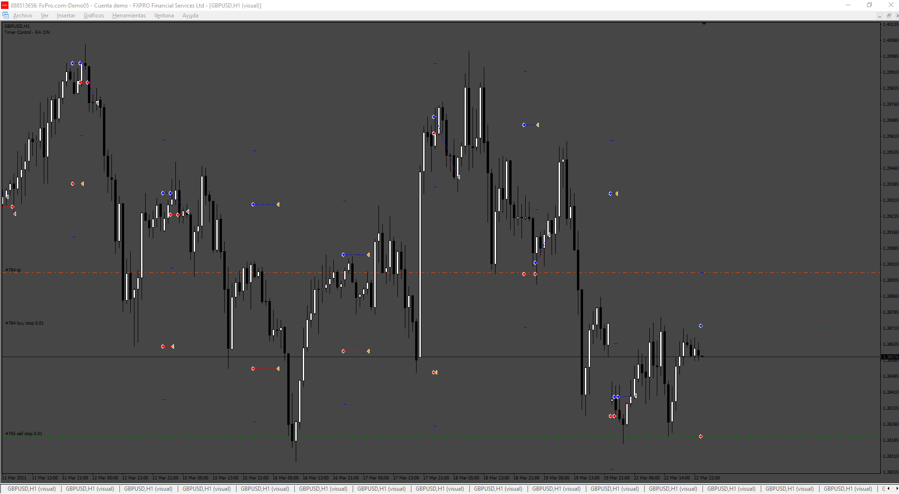
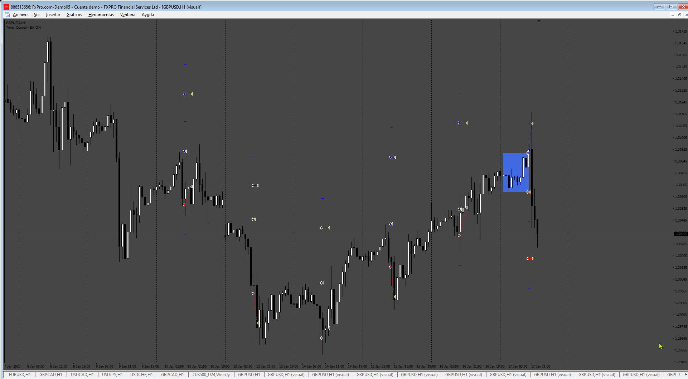

# Breackout_EA

> Source: https://fxcodebase.com/code/viewtopic.php?f=38&t=75106  
> Forum: 38 · Topic 75106 · 4 post(s)

---

## Breackout_EA

**Apprentice** · Tue Jul 30, 2024 3:44 pm

Based on the request.
[https://fxcodebase.com/code/viewtopic.p ... 15#p156215](https://fxcodebase.com/code/viewtopic.php?f=27&p=156215#p156215)

 [Breackout_EA.mq4](files/156273/Breackout_EA.mq4)

---

## Re: Breackout_EA

**danjuma** · Thu Aug 01, 2024 1:13 pm

Hello Apprentice. Many thanks for the EA. I did a quick test and straight off the bat there was an issue - the EA kept placing and immediately deleting the pending orders continuously. Also, the range I want for the high and low is a time range (i.e. there should be a start time and end time to define the range/session), however the EA appears to be looking at bars (from the input asking how many bars to kook at). Anyway, I have managed to put together (with the assistance of AI) an EA that does what I want. So, no need to spend any more time on this.

---

## Re: Breackout_EA

**Apprentice** · Mon Aug 05, 2024 4:16 am

We have added your request to the development list.
Development reference 631

---

## Re: Breackout_EA

**Apprentice** · Sun Sep 01, 2024 2:45 pm

 [Breackout_EA.mq4](files/156549/Breackout_EA.mq4)
