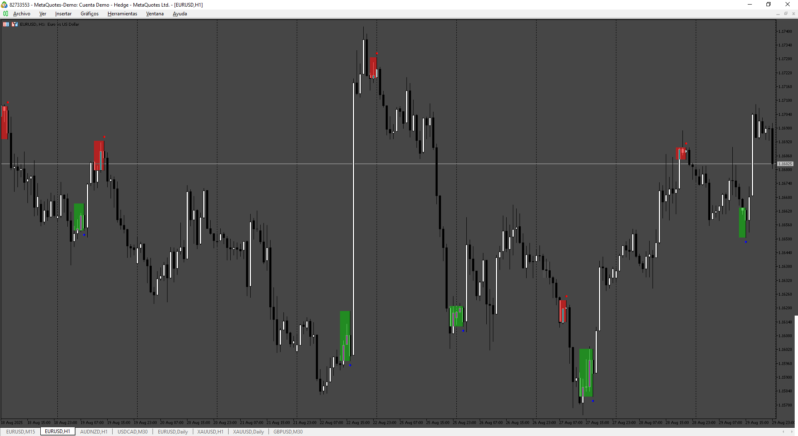

# BreackoutZones

> Source: https://fxcodebase.com/code/viewtopic.php?f=38&t=76290  
> Forum: 38 · Topic 76290 · 4 post(s)

---

## BreackoutZones

**Apprentice** · Tue Sep 02, 2025 4:02 am

Based on the request.
[https://fxcodebase.com/code/viewtopic.php?f=17&t=76271](https://fxcodebase.com/code/viewtopic.php?f=17&t=76271)

 [BreackoutZones.mq5](files/160443/BreackoutZones.mq5)

---

## Re: BreackoutZones

**Dan19900** · Wed Sep 03, 2025 1:15 am

Hello, Can you make Mt4 version?

---

## Re: BreackoutZones

**pugspuggy** · Thu Sep 04, 2025 3:37 am

Can I kindly request for MT4 version of this indicator? Thanks.

---

## Re: BreackoutZones

**Apprentice** · Thu Sep 04, 2025 4:57 am

We have added your request to the development list.
Development reference 560
