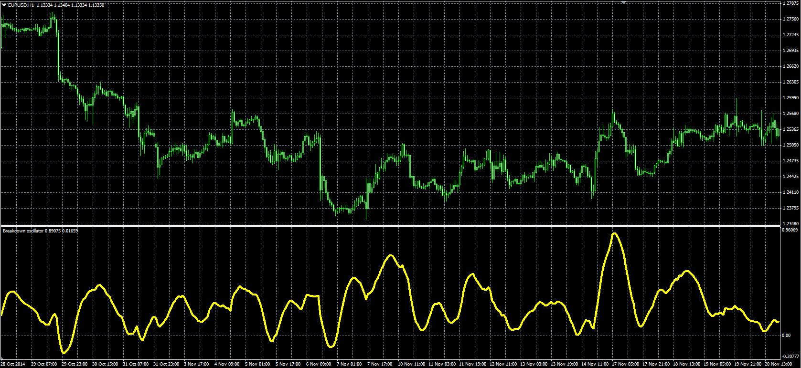

# Breakdown Oscillator

> Source: https://fxcodebase.com/code/viewtopic.php?f=38&t=62251  
> Forum: 38 · Topic 62251 · 1 post(s)

---

## Breakdown Oscillator

**Alexander.Gettinger** · Fri May 22, 2015 10:21 am

Original LUA oscillator: [viewtopic.php?f=17&t=62053](https://fxcodebase.com/code/viewtopic.php?f=17&t=62053).

Formula:
Breakdown = 100*EMA/Bottom, where
EMA = EMA(Difference) with [Short_Length] number of periods,
Difference[i] = Price[i]-Bottom[i]+Slope_Factor*(SMA[i]-SMA[i-1]),
Bottom[i] = SMA[i]-Deviation*StdDev,
StdDev - Standard Deviation(Price) with [Band_Length] number of periods,
SMA = MVA(Price) with [Short_Length] number of periods.

 

Download:

 [Breakdown_Oscillator.mq4](files/100615/Breakdown_Oscillator.mq4)
