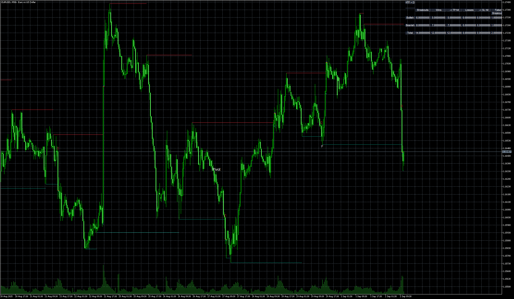

# Breakout_Detector_(Previous_MTF_High_Low_Levels)_5D

> Source: https://fxcodebase.com/code/viewtopic.php?f=38&t=76287  
> Forum: 38 · Topic 76287 · 4 post(s)

---

## Breakout_Detector_(Previous_MTF_High_Low_Levels)_5D

**Apprentice** · Tue Sep 02, 2025 3:37 am

Based on the request.
[https://fxcodebase.com/code/viewtopic.p ... 96#p159696](https://fxcodebase.com/code/viewtopic.php?f=17&t=76067&p=159696#p159696)

 [Breakout_Detector_(Previous_MTF_High_Low_Levels)_5D.mq5](files/160436/Breakout_Detector_%28Previous_MTF_High_Low_Levels%29_5D.mq5)

---

## Re: Breakout_Detector_(Previous_MTF_High_Low_Levels)_5D

**khanatd** · Mon Oct 20, 2025 11:54 pm

hi sir plz add mt4 non repaint arrows at close of current candle or reversals/continuations /breakers etc

thanks
khan g

---

## Re: Breakout_Detector_(Previous_MTF_High_Low_Levels)_5D

**khanatd** · Tue Oct 21, 2025 4:19 am

hi sir plz add mt4 non repaint arrows at close of current candle or reversals/continuations /breakeouts etc

thanks
khan

---

## Re: Breakout_Detector_(Previous_MTF_High_Low_Levels)_5D

**Apprentice** · Tue Oct 21, 2025 9:32 am

We have added your request to the development list.
Development reference 672
